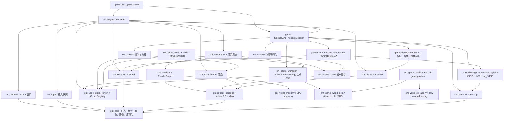

# ScienceAndTheology 自研引擎架构设计

> 当前架构基线，更新于 2026-07-14。
>
> 核对范围：固定的引擎子模块基线为 `82a329f10dbd525b2651e50e961e6f8e029d807f`，并包含 `Runtime + IGameSession`、game-owned P7.2.1 机器运行态、P0 CMake 依赖隔离和 A 方案 voxel/game world 数据边界变更。
> 本文只描述顶层 CMake 实际构建的自研引擎链；`src/`、Godot 场景、GDScript 和 GDExtension 是迁移来源，不是当前运行时架构。

## 1. 结论

自研引擎的技术方向可以继续：C++20、SDL3、Vulkan 1.3、EnTT、AngelScript、保留模式 UI、显式宿主路径和独立引擎仓库之间没有根本冲突。当前最有价值的设计是：

- 游戏宿主拥有可执行程序、内容和打包，引擎只提供静态库。
- 宿主输入的 `RuntimePaths` 显式区分 `engine_root`、`game_root` 和 `user_root`；`Runtime` 将其规范化为实例拥有的 `RuntimePathResolver`，引擎不猜测源码目录，也不保存进程全局根目录。
- Vulkan 后端、RenderGraph、ECS 渲染、纯 voxel meshing 已分层。
- `Expected<T>`、错误上下文和分频道日志构成了统一的失败诊断路径。
- AngelScript 热重载采用 `ScriptId`、值拷贝注册和事务回滚，不保存跨重载 VM 指针。
- `EntityGuid` 与运行时 `entt::entity` 分离，为场景和存档提供稳定身份。
- `Runtime` 已取代旧 `Engine`，以 `RuntimeServices`、`WorldSession` 和 `IGameSession` 把游戏内容从引擎生命周期中移出。

问题不在技术选型，而在模块契约和运行时组合仍停留在原型阶段：

| 优先级 | 问题 | 当前影响 |
| --- | --- | --- |
| P0 | `Runtime` 已通过 `SystemScheduler` 运行生产 ECS 系统，game-owned `MachineTickSystem` 与 `PlayerPhysicsSystem` 已进入独立 worker 路径 | 已消除 `World::update` 绕过调度器的路径；机器系统在单个 task 内按稳定顺序分片，玩家碰撞只消费值快照；两个任务的资源声明无冲突，可在同一 barrier 前并发 |
| P1 | 体素世界数据边界已按 A 方案完成首轮迁移 | 引擎只保留 `snt_voxel_data` 与 `snt_voxel_storage`；方块实体、生态、物种、生成、语义化存档和移动结构由 `game/` 目标拥有 |
| P1 | 网络只有头文件契约，音频尚不存在，无头模式没有运行时入口 | 文档不能把网络、音频或 dedicated server 写成现有能力 |
| P2 | 部分 P1/P2/P3 阶段注释仍描述已经替换的实现 | 容易让维护者按过时路径继续开发 |

因此结论是：不需要推倒重来。新的玩法内容必须进入 `IGameSession`，不能重新写回 `Runtime`；Runtime 已使用安全调度契约，后续应只把能够提供值快照和确定性写回的纯计算系统迁移到 worker，并继续收敛游戏内容边界。

## 2. 仓库和所有权边界

### 2.1 当前构建入口

顶层只构建两个子项目：

```text
ScienceAndTheology/
├── CMakeLists.txt                 # 添加 snt_engine 和 game
├── game/                          # 游戏宿主、配置、场景、脚本和打包
│   ├── client/main.cpp            # 唯一游戏可执行程序入口
│   ├── config/
│   ├── scenes/
│   └── scripts/
└── snt_engine/                    # 独立 Git 子模块，C++20 运行时库
```

旧 `src/`、`scripts/`、`project.godot`、`*.tscn` 和 GDExtension 文件不进入当前顶层 CMake 构建。它们只能作为迁移参考；迁移完成的旧接口应删除，不增加兼容层。

### 2.2 宿主职责

`game/client/main.cpp` 负责：

1. 定位可执行程序目录。
2. 构造 `RuntimePaths`。
3. 从 `game/config/engine.json` 读取配置。
4. 分别读取 `RuntimeConfig` 与游戏会话配置，创建 `ScienceAndTheologySession`。
5. 创建 `snt::engine::Runtime`，调用 `init`、`run`、`shutdown`，并把会话所有权移交给 Runtime。
5. 由 `game/CMakeLists.txt` 将着色器、ICU 数据、场景、脚本和游戏资产组装到运行包。

运行包契约：

| 路径 | 所有者 | 内容 |
| --- | --- | --- |
| `<exe>/engine/` | 引擎 | SPIR-V 着色器、ICU 数据等只读资源 |
| `<exe>/game/` | 游戏 | 配置、场景、AngelScript 和游戏资产 |
| `<exe>/user/` | 用户数据 | 日志、存档和缓存，可写 |

引擎不得访问游戏源码树、父目录或 `snt_engine` 子模块名来推断路径。

## 3. 当前模块图

下图表示当前主要 CMake 目标的实际职责。箭头表示“使用/链接”，不是目标状态中的理想纯分层。



### 3.1 模块现状

| 模块/目标 | 当前职责 | 状态和边界 |
| --- | --- | --- |
| `snt_core` | 日志、`Expected/Error`、时钟、Job System、路径、配置、二进制 IO、UUID | 路径通过不可变 `RuntimePathResolver` 实例解析；Logger 仍是进程级诊断设施 |
| `snt_platform` | SDL3 窗口、事件轮询、鼠标锁定、Vulkan surface | 已实现；当前仅 Windows 开发环境被正式支持 |
| `snt_input` | SDL 事件转输入快照 | 已实现；公共头依赖 `core/events.h` |
| `snt_render_backend` | Vulkan instance/device/swapchain/frame、descriptor、pipeline、buffer | 已实现原型；仍暴露较多 Vulkan 类型 |
| `snt_renderer` | RenderGraph、pass、资源状态、瞬态池、pipeline cache | 已实现并被 `RenderSystem` 使用 |
| `snt_assets` | manifest、稳定 handle、mesh/texture/shader/font 相关缓存 | AssetManager 已由 Runtime 实例拥有并直接借用 Vulkan device；尚非后端无关资产层 |
| `snt_render_components` | `Transform`、`Camera`、`MeshRef` 与对应序列化 | header-only presentation contract；场景和会话可使用它而不链接 Vulkan `RenderSystem` |
| `snt_ecs` | `World`、稳定 Guid、核心 `Position`/`Velocity`、System、EventBus、`SystemScheduler` | 只拥有与表现和玩法无关的 ECS 数据；不再链接 assets 或 input |
| `snt_render` | 读取 `Transform + MeshRef` 并构造 RenderGraph pass | 已实现 |
| `snt_scene` | 二进制场景 v1，保存/加载 Transform、MeshRef、Camera | 已实现，header-only；不是完整游戏存档 |
| `snt_ui` | Unicode 文本、保留模式 View、Arc2D、Vulkan UI renderer | 只保留通用 UI 原语和渲染后端；背包、合成、性能面板及试玩数据由 `game/client/gameplay_ui.*` 拥有 |
| `snt_voxel_data` | terrain cell、`VoxelChunk`、`ChunkKey`、`ChunkRegistry` | 引擎通用值类型；Runtime、renderer、player 只依赖此层，不含玩法 sidecar |
| `snt_voxel_storage` | raw region v2 framing、compaction、`IVoxelWorldStorage` 声明 | 引擎只保存不解释的 chunk payload bytes |
| `snt_game_world_data` | 方块实体、生态、物种、玩法配置、`GameChunkSidecarRegistry` | game-owned；与 `VoxelChunk` 以 `ChunkKey` 对齐 |
| `snt_game_worldgen` | noise、世界生成配置、地形和 sidecar 生成 | game-owned；返回临时 `GameChunk` 组合值 |
| `snt_game_world_save` | `GameChunkSerializer`、`GameSaveManager`、planet summary | 只接受完整 game payload v9；通过 raw v2 region framing 持久化 |
| `snt_game_world_mobile` | 飞船、动态结构和局部网格 | game-owned；尚未由当前会话编排 |
| `snt_voxel_mesh` | greedy meshing 和碰撞面生成 | 已实现，纯 CPU，可用于无渲染测试 |
| `snt_voxel` | chunk remesh/upload/draw | 已实现，依赖 Vulkan、ECS 和通用 voxel data |
| `snt_player` | 第一人称输入/交互、voxel 碰撞、DDA 射线和玩家物理 worker | `PlayerControllerSystem` 保持主线程输入和方块编辑；`PlayerPhysicsSystem` 以 terrain 值快照在 worker 积分，barrier 写回 player state 与相机 |
| `snt_script` | AngelScript VM、loader、watcher、`IScriptContentHost` 事务协调 | 不再包含具体玩法定义或 `snt_*` binding；宿主必须在 `ScriptManager::init()` 前注入内容宿主 |
| `game/client/game_content_registry.*` | 配方、机器、任务、事件、临时脚本状态和 `snt_*` binding | 由 `ScienceAndTheologySession` 拥有；保留内建回退、稳定 ScriptId、值拷贝与 reload 提交/回滚 |
| `game/client/machine_tick_system.*` | `MachineTickSystem`、机器运行态、配方快照和事件 sink | P7.2.1 由游戏拥有并作为 scheduler worker：主线程复制注册表/组件快照；大批机器在 worker 内分片计算，barrier 后主线程按 Guid 顺序写回 |
| `snt_network` | `IReplicationTransport`、`ReplicationService` 声明 | 仅 `network/replication.h`，没有 CMake 目标和实现 |
| `snt_audio` | 计划中的音频服务 | 不存在 |
| `snt_engine` | `Runtime` 生命周期、通用服务、渲染与 world 基础设施 | 已实现 `IGameSession` 回调边界；不再加载场景、脚本、玩家或玩法 UI |
| `snt_tests` | 独立引擎 GoogleTest 可执行程序 | 覆盖 core、asset、script、ECS、scene、通用 voxel data/storage、player、通用 UI、RuntimeConfig；不覆盖完整 Runtime/Vulkan 启停 |
| `snt_game_tests` | game-owned GoogleTest 可执行程序 | 覆盖玩法 UI、内容注册、热重载、机器 worker，以及 game worldgen、sidecar、serializer 和 save split |
| `gen_default_scene`、`snt_game_world_test` | 场景生成和游戏 world/ECS smoke benchmark | 已实现 |

### 3.2 CMake 依赖隔离（已实现）

`snt_engine_settings` 现在只保留 C++ 标准、编译选项和全局编译定义；它不再向所有目标隐式导出引擎源码根目录。每个引擎模块在 `cmake/module_dependency_audit.cmake` 中注册自身的 build-interface include 根、源码范围和 `#include "module/..."` 前缀所有权。

配置期审计会扫描注册模块的 `.h`、`.hpp`、`.inl`、`.cpp` 和 `.cxx` 文件，将带引擎模块前缀的 quoted include 映射到唯一 CMake 目标，并验证该目标直接出现在消费者的 `target_link_libraries` 中。编译目标只能通过 `PUBLIC` 或 `PRIVATE` 使用实现依赖，header-only 目标才可使用 `INTERFACE`。任何遗漏都会在生成构建文件前失败，并报告消费者目标、源码位置、include 与缺失目标。当前基线覆盖 18 个引擎目标和 131 条内部 include 边；第三方头与非构建的 `network/` 声明不在此检查范围。

`snt_voxel_mesh`、`snt_voxel_data`、`snt_voxel_storage` 与 `snt_voxel` 共用 `voxel/` 源码树但拥有不同的头文件所有权，因此注册表显式列出前缀和范围。新增共享目录中的公开头时必须同时更新其目标归属。game-owned `game/world/...` 不进入引擎模块审计；它通过显式 CMake target 直接链接 `snt_voxel_data` 或 `snt_voxel_storage`。

本次修正的直接依赖如下：

| 目标 | 直接依赖 | 可见性 | 原因 |
| --- | --- | --- | --- |
| `snt_input` | `snt_core` | `PUBLIC` | `input_system.h` 暴露 `core/events.h` 类型 |
| `snt_ecs` | `snt_core` | `PUBLIC` | 公共 World/scheduler 使用 core 的错误、作业和命令类型；核心组件不再暴露资产句柄 |
| `snt_render_components` | `snt_core`、`snt_assets` | `INTERFACE` | 公开 serializer 与 `MeshRef` 使用 core 二进制 IO 和 canonical `MeshHandle` |
| `snt_render` | `snt_render_components` | `PRIVATE` | RenderSystem 实现解释 presentation 组件，公开 RenderSystem 头不暴露它们 |
| `snt_render_backend` | `snt_core` | `PUBLIC` | 公共 Vulkan 封装返回 core 的错误/结果类型 |
| `snt_render_backend` | `snt_platform` | `PRIVATE` | surface 创建实现使用 `Window` |
| `snt_voxel` | `snt_core`、`snt_voxel_data` | `PUBLIC` | 公开 chunk 系统使用作业、错误和 generic `VoxelChunk` 类型 |
| `snt_player` | `snt_voxel_data` | `PUBLIC` | `voxel_collision.h` 暴露 generic voxel collision world 所需的 chunk 类型 |

审计检查“是否直接声明”，不从 include 的可达性推导 `PUBLIC`/`PRIVATE`。可见性仍按公开头实际暴露的类型审查；这能避免把实现依赖误传递给宿主。`snt_engine` 继续是宿主使用的 facade，但不享有审计豁免，也不会反向为下层模块提供头文件或链接依赖。

验证分三层执行：

1. 每次 CMake 配置自动运行依赖审计，未声明内部 include 立即失败。
2. CI 分别构建 `snt_core`、`snt_ecs`、`snt_render_backend`、`snt_voxel_mesh`、`snt_voxel` 和 `snt_engine`，再构建游戏宿主。
3. `snt_tests` 覆盖独立引擎行为、通用 voxel storage 和显式内容宿主契约；`snt_game_tests` 覆盖宿主玩法 UI、内容注册、热重载、机器运行态与 game sidecar save/load；依赖审计只验证构建图，不以运行测试替代链接隔离。

不采用 `CMAKE_LINK_WHAT_YOU_USE` 作为唯一防线：它对静态库和 MSVC 的间接符号情况不能完整覆盖，也无法识别仅在公开头中泄漏的依赖。

## 4. 当前运行时

### 4.1 初始化和关闭

当前 `Runtime::init` 的主要顺序是：

```text
RuntimePaths -> RuntimePathResolver
  -> Job System + 文件日志
  -> FilesystemAssetSource(game_root)
  -> AssetCatalog(config.assets.manifest_path)
  -> SDL Window + Input EventBus
  -> Vulkan instance/surface/device
  -> AssetManager(device, source, catalog)
  -> swapchain/depth/descriptor/pipeline/frame
  -> RenderSystem + RenderGraph
  -> generic voxel renderer + generic UI renderer
  -> RuntimeServices + WorldSession
  -> IGameSession::register_content
  -> IGameSession::create_world
```

`ScienceAndTheologySession` 目前在两个回调中拥有脚本加载、场景、固定 camera Guid、试玩 terrain、玩家控制器和玩法 UI。`shutdown` 先调用 session，再停止 Job System，随后释放 world/render/GPU 资源；这保证 worker 不会在 world 或 GPU 资源销毁后继续访问快照结果。GPU 资产仍在 Vulkan device 前释放。CMake 目标依赖已在配置期审计；运行时初始化/关闭顺序仍由 `Runtime::Impl` 和手写代码维持，尚无运行时依赖图自动校验。

### 4.2 帧和 tick

当前真实执行模型：

- 主线程轮询 SDL、更新 `InputState`，调用 `IGameSession::frame` 处理脚本 watcher 和游戏输入。
- `Runtime` 使用固定 20 TPS、每帧最多补 5 tick；超出后丢弃债务并每秒输出一次聚合警告。
- 每个逻辑 tick 先调用 `IGameSession::fixed_tick`，再调用 `SystemScheduler::fixed_tick(world, 0.05f)`；`ChunkRenderSystem` 与 `PlayerControllerSystem` 在主线程处理 mesh 提交、输入和方块交互，game-owned `MachineTickSystem` 与 `PlayerPhysicsSystem` 分别捕获值快照后在 worker 执行并于 barrier 写回；机器达到阈值时，其纯计算按固定索引分片。
- RenderGraph 每帧运行，和逻辑 tick 分离。
- `IGameSession::build_ui` 通过 `UiContext` 提交 View 或 Arc2D 命令；Runtime 统一合并和提交 UI draw data。
- `Runtime` 独占一个 `SystemScheduler`；`WorldSession` 只能通过 `register_main_system` / `register_worker_system` 注册系统，`World` 不再拥有系统或提供 update 入口。

这意味着当前可声称“固定步长逻辑 + 多线程 Job System + Runtime 已接入的 ECS 调度契约 + 两个资源独立的生产 worker”。`gameplay.machine_tick` 与 `player.physics` 可由 DAG 同时提交；后者的任务量目前较小，但该路径已验证跨系统并行扇出、确定性 command 顺序和主线程 World 写回，而不是仅依赖单个 worker 内部并行。

### 4.3 线程约束和调度契约

以下硬规则适用于当前运行时，也定义了 `SystemScheduler` 的实现边界：

| 对象/操作 | 允许线程 |
| --- | --- |
| SDL 窗口、输入事件、AngelScript reload、EnTT `World` 结构变更 | 主线程 |
| Vulkan 提交、GPU 资源创建/销毁、UI draw data 合并 | 渲染主线程 |
| 日志写入 | 任意线程，Logger 内部串行化 |
| world generation、greedy meshing 等纯计算 | worker，但输入必须是不可变快照，结果通过队列回主线程提交 |
| worker 直接持有 `World&` 并异步写入 | 禁止 |

`SystemScheduler` 已实现以下固定 tick 契约：

- 每个已注册系统提供 `SystemMetadata`：唯一非空名称、`MainThread`/`Worker` 亲和性，以及命名资源的读/写声明。
- 主线程系统按注册顺序调用 `System::update(World&, dt)`；`capture()` 也只在主线程执行。
- worker 系统通过 `IWorkerSystem::capture(const World&, dt)` 生成独立 `IWorkerTask`。任务执行入口只有 `WorkerCommandContext&`，不得保存 `World`、registry 或组件引用。
- 相同资源且至少一方写入时，调度器按注册顺序建立 DAG 依赖；无冲突任务可并行提交给 `JobSystem`。
- `WorkerCommandContext::parallel_for` 是受限的同步纯计算入口：子 job 只写入相互独立的调用方结果槽，不得入队 World command；父 task 等待完成后按稳定顺序串行入队。`JobHandle` 记录所属线程池，worker 等待子 job 时会帮助执行队列，因此单 worker 配置不会在嵌套分片处死锁。
- 每个 tick 等待所有 `JobHandle`，再由主线程按“系统注册顺序 + 任务内局部序号”确定性应用 `WorldCommandQueue`。因此没有任务或 World command 可跨 tick。
- `shutdown()` 等待已跟踪 job 后清空未应用命令；随后拒绝新的注册、启用状态变更和 tick。
- worker barrier 超过 50 ms 时记录诊断，并最多每秒输出一次聚合 Warning；被抑制的慢 barrier 次数会进入下一条日志，避免高频刷屏。

该契约已经由 metadata 校验、快照/command barrier、资源冲突 DAG、确定序命令、嵌套等待和 shutdown 测试覆盖。Runtime 已在 job system 初始化后独占 scheduler，`WorldSession` 负责系统注册，`World` 不再保存系统。当前生产注册顺序为主线程 `voxel.chunk_render`、`player.controller`，worker `gameplay.machine_tick`、`player.physics`。机器 worker 只复制 `GameContentRegistry` 配方和 `MachineRuntimeComponent`，不会把 World、内容注册表或事件 sink 带入子 job；机器数达到 32 时，父 task 将纯计算拆为 16-machine tile，完成后仍按 Guid 顺序入队。玩家 worker 在主线程从其扫掠 AABB 复制 `VoxelCollisionSnapshot`，worker 只积分 `PlayerControllerState`，再经 command queue 写回该状态和相机 Transform；它从不保留 `ChunkRegistry`、World 或组件引用。两个 worker 的资源集不相交，因此 scheduler 不建立依赖边。`ChunkRenderSystem` 保持现有跨帧异步 mesh snapshot 管线，不接入 fixed-tick barrier，以避免重 meshing 直接造成逻辑 tick 卡顿。

## 5. 数据、场景和资产

### 5.1 场景与世界存档是不同域

| 域 | 当前格式 | 用途 |
| --- | --- | --- |
| Scene | `SNTS` v1 | 启动实体模板，目前只有 Transform、MeshRef、Camera |
| World save | game payload v9 + raw region framing v2 | `GameSaveManager` 组合 generic voxel chunk 与 game sidecar；仅接受当前格式 |
| Script `StateStore` | 内存 map | 只跨脚本 reload，不跨进程持久化 |

不得把 Scene 当世界存档，也不得把 `StateStore` 当玩家持久化状态。P7 的机器/任务进度应进入 save 域，并以稳定内容 key 而不是运行时指针或 VM 对象持久化。

### 5.2 版本策略

项目尚未正式发布，目标策略是只保留最新格式：

- 写入端只写当前版本。
- 读取端遇到非当前版本或不完整数据立即拒绝；日志只在场景加载失败或一次 save 扫描汇总时记录，避免逐文件刷屏。
- 不维护旧版本迁移器、旧字段兼容和静默跳过。
- 开发期格式升级时，同步重生成测试资产和场景文件。

当前实现已无旧格式分支：game-owned `GameChunkSerializer` 只接受完整的 v9 payload，engine-owned `VoxelRegionFile` 只接受 raw region v2 framing，`GameSaveManager` 在一次维度加载中汇总报告被拒绝的 region/chunk 数，Scene v1 只接受当前已知组件类型。格式升级时直接重生成开发资产和场景。

### 5.3 资产边界

当前 Mesh handle 是稳定的值类型，但 `AssetManager` 本身直接依赖 Vulkan device。建议把资产分成两个层次：

```text
Asset catalog/source
  - path、manifest、稳定 ID、文件读取、依赖关系
  - 不依赖 Vulkan

GPU asset residency
  - mesh/texture/shader 上传、缓存、销毁和热重载
  - 依赖 render device，遵守渲染线程
```

这样无头服务端仍能读取内容清单和碰撞数据，而不需要创建 Vulkan device。

`IAssetSource` 已由 `assets/filesystem_asset_source.*` 获得首个实现，`AssetCatalog` 已成为它的首个真实消费者。Runtime 现在从 `RuntimePaths::game_root` 创建 source，按 `RuntimeConfig::assets.manifest_path` 加载 catalog，并把两者注入 `RuntimeServices` 与 `AssetManager`；`IGpuAssetUploader` 已由 `VulkanGpuAssetUploader` 获得首个实现：

- `FilesystemAssetSource` 在创建时拥有规范化的现存目录根；`read()` 只接受相对路径，以路径组件检查拒绝任何带 root name/root directory 的路径、`..` 和解析后的 symlink escape，并返回拥有 `canonical_path` 和 `bytes` 的 `AssetSourceData`。它可由加载 worker 调用，不访问 GPU、`World` 或全局服务。
- `AssetCatalog::load(IAssetSource&, AssetSourceRequest)` 通过 source 读取 manifest，将稳定 ID 映射为同一 source 的相对请求；manifest JSON 解析现在是无 I/O 的 `parse_manifest()`，缺失 manifest 与现有运行路径一致地得到空 catalog。
- `IGpuAssetUploader::upload(GpuAssetUploadRequest)` 按值接收已拥有的源数据，返回不暴露 Vulkan 句柄的 `GpuAssetResidencyToken`；`release()` 与 `evict_unused()` 明确逻辑 lease 释放和延迟回收的分界。uploader 绑定 render thread/device 生命周期，device 停止后其 token 全部失效。
- `VulkanGpuAssetUploader` 以 canonical source identity 去重底层 `VulkanMesh`，但每次 upload 都返回独立 token lease；release 仅放弃 lease，evict 才物理销毁已释放资源。初始化、实际 upload、evict 和 shutdown 均记录低频生命周期日志。
- `AssetManager` 使用 `MeshAssetReferenceRegistry` 保存 source request 到稳定 `MeshHandle` 的映射，按 catalog 顺序执行 `IAssetSource -> IGpuAssetUploader` 预加载；`RenderSystem` 只经 `AssetManager::mesh(handle)` 取借用 mesh，关闭时 wait-idle 后 release/evict。legacy mesh cache、`VulkanMeshLoader` 与无生产调用的 `AssetCache` 均已删除；scene/tool 仅依赖 Vulkan-free 的 `IMeshAssetReferenceResolver`。

## 6. ECS 和玩法边界

### 6.1 当前 ECS

`snt::ecs::World` 包装 EnTT registry，负责：

- 创建/销毁实体。
- `EntityGuid <-> entt::entity` 双向映射。
- 组件访问和 view。
- 按注册顺序执行 `System::update(World&, dt)`。

组件已按所有权拆分；旧 `ecs/components.h` 与未接入 Runtime 的 `CameraSystem` 已删除，不保留兼容包装：

- `ecs/core_components.h`：Guid、Position、Velocity 等不依赖资产/渲染的组件。
- `render/render_components.h`：Transform、Camera、MeshRef。
- 游戏模块：Health、Inventory、玩家/生物/机器 marker。

现在 `snt_ecs` 不再依赖 `snt_assets` 或 `snt_input`，headless world 不会被 GPU asset、camera 或本地玩家输入类型污染。

### 6.2 Script Content Host

`snt_script` 只提供 `IScriptContentHost`、稳定 `ScriptId`、模块 loader、watcher 和通用事务调度。`ScienceAndTheologySession` 在 `ScriptManager::init()` 前注入 `GameContentRegistry`，后者提供：

- Recipe、Machine、Quest 定义注册与 `snt_*` AngelScript 声明。
- Event listener 的稳定 `(ScriptId, callback_id)` 表示。
- 按 `ScriptId` 隔离的会话状态。
- `begin_reload`、`commit_reload`、`rollback_reload` 事务。
- 内建定义回退和确定性 map 枚举。

尚未实现的其他机器类型、任务进度存档、网络 replication 和大量旧玩法接口，不属于当前 Script API。详细迁移顺序见 [p7_玩法迁移设计.md](p7_玩法迁移设计.md)。

### 6.3 P7.2.1 机器运行态

`game/client/machine_tick_system.*` 中的 `snt::game::MachineTickSystem` 已接入 Runtime 的 `SystemScheduler` worker 路径：

- 按稳定 `EntityGuid` 排序，保证运行和事件顺序确定。
- 开工时复制 game-owned `RecipeDefinition` 为 `MachineRecipeSnapshot`，脚本 reload 只影响新任务。
- 输入在开工时预扣；能量不足和输出阻塞保留进度，不丢物品。
- `IMachineTickEventSink` 是 UI、任务、存档脏标记和 replication 的预留接口。

### 6.4 玩家物理 worker

`snt_player` 现在把主线程交互和 worker 物理拆开：

- `PlayerControllerSystem` 读取 `InputState`、更新视角和移动意图，并在主线程执行 DDA 选块、terrain 修改和 `ChunkRenderSystem::mark_dirty`。
- `PlayerPhysicsSystem` 的 `capture()` 仅复制 `PlayerControllerState`、调参和扫掠 AABB 内的 `VoxelCollisionSnapshot`；快照只包含固体位，不保留 `ChunkRegistry` 或 chunk 指针。
- `IVoxelCollisionWorld` 是碰撞和射线使用的窄只读查询边界；主线程使用 `CollisionWorldView`，worker 使用值拥有的 `VoxelCollisionSnapshot`。
- worker 结束时仅通过 `WorldCommandQueue` 写回玩家状态和 camera Transform。它声明读取 `world.chunks`、读写 `player.controller_state`、写入 `ecs.camera_transform`，因此与机器的 `ecs.machine_runtime` / `game.content_registry` 路径无冲突。

该拆分保持一次 fixed tick 内“先输入/交互、再碰撞、最后更新相机”的原有语义，同时建立后续多玩家或 AI 碰撞批处理可复用的值快照边界。快照大小按实际扫掠范围裁剪，典型单人 tick 只复制几十个体素，而不是整个 chunk。
- `capture()` 只在主线程复制机器组件和候选配方；worker 生成值类型补丁，`WorldCommandQueue` 在 barrier 后写回组件并派发事件，因此 ScriptManager 和 EventSink 不跨线程。
- 机器数达到 32 时，worker parent 通过同步 `parallel_for` 将纯计算拆为 16-machine tile；子 job 只写预分配结果槽，所有 command 和 event 仍由 parent 按 `EntityGuid` 顺序生成。单 worker pool 会在等待子 tile 时执行可运行 job，不会死锁。
- 状态异常及恢复只记录状态变化日志，不记录每 tick 或每次完成日志。

## 7. 运行时接口

`Runtime + IGameSession` 已在当前工作区实现。公开头位于 `engine/runtime.h`、`engine/runtime_services.h` 和 `engine/game_session.h`；以下为当前稳定契约的简化形式：

```cpp
class IGameSession {
public:
    virtual ~IGameSession() = default;
    virtual Expected<void> register_content(RuntimeServices& services) = 0;
    virtual Expected<void> create_world(WorldSession& world) = 0;
    virtual void fixed_tick(FixedTickContext& context) = 0;
    virtual void frame(FrameContext& context) = 0;
    virtual void build_ui(UiContext& context) = 0;
    virtual void shutdown() noexcept = 0;
};
```

`RuntimeServices` 由 `Runtime` 实例拥有，显式提供 `RuntimeConfig`、不可变的 `RuntimePathResolver`、clock、logger、jobs、assets 和 scripts；游戏会话通过 `services.paths().resolve_game(...)` 等显式取得资源路径，不再经过 RuntimeServices 的字符串转发包装。`WorldSession` 提供 World、ChunkRegistry、输入、EventBus、active camera 和鼠标锁定边界。`FrameContext` 只能在回调期间使用，`UiContext` 只允许提交 View/Arc2D draw data，不暴露 Vulkan 指针。

当前 `JobSystemP2`、`FilesystemAssetSource`、`AssetCatalog`、`AssetManager`、`ScriptManager` 与 `RuntimePathResolver` 均由 `Runtime::Impl` 实例拥有：Job System 通过构造函数注入 `SystemScheduler` 与 `ChunkRenderSystem`；AssetManager 在初始化时借用 source、catalog 和 Vulkan device，并通过 `RuntimeServices` 注入游戏内容、显式提供给 `RenderSystem`；ScriptManager 通过 `RuntimeServices` 注入游戏内容并由 Runtime 统一关闭。体素图集、MUI 着色器和 ICU 数据在初始化阶段借用 resolver，不保留跨 Runtime 引用。`default_job_system()`、`AssetManager::instance()`、`ScriptManager::instance()`、`path_utils::configure()`、`runtime_paths()` 和全局 `resolve_*()` 均已删除，系统不能再隐式借用进程全局线程池、资产缓存、脚本 VM 或路径根。

`IRuntimeModule` 的资源访问声明、依赖图和线程亲和性仍是待声明/实现的调度层契约，不能据此宣称安全 ECS 并行已完成。

已经存在并应保留的预留契约：

- `IReplicationTransport`：传输只收发 frame，不直接改 World。
- `ReplicationService`：协议版本和主线程应用边界。
- `IWorldCommandQueue`：已由 `ecs/world_command_queue.h` 实现；worker 和网络线程只能入队，`SystemScheduler` 在 tick barrier 的主线程应用命令。
- `IRuntimeObserver`：`engine/runtime_observer.h` 已声明只读生命周期/性能值快照；订阅与回调频率暂不实现，观察者不获得可写子系统指针。

已接入的 GPU asset 契约：

- `IGpuAssetUploader`：`VulkanGpuAssetUploader` 已实现 token lease、release 和 deferred evict；AssetManager 借用 source/catalog/device，在 render thread 完成 mesh 上传与关闭回收，场景引用通过独立的 `IMeshAssetReferenceResolver` 保持 Vulkan-free。

仍需声明但暂不实现的契约：

- `IAudioDevice` / `IAudioScene`：避免玩法代码直接依赖 miniaudio。

## 8. 需要选择的方案

### 8.1 Runtime 与游戏内容边界

| 方案 | 优点 | 缺点 |
| --- | --- | --- |
| A. 保持专用单体 `Engine` | 改动最少，短期迭代最快 | 无头、测试、编辑器和多会话难做；游戏内容继续污染引擎 |
| B. `Runtime + IGameSession` | 边界清晰；演示内容和玩法 UI 位于 game；适合 dedicated server | 需要重排初始化、配置和依赖注入 |
| C. 所有模块动态插件化 | 最大扩展性，可按需加载 | 当前规模明显过度设计，ABI 和卸载顺序成本高 |

已于 2026-07-11 选择并完成 B 的首轮实现。A 不再是可继续扩展的接口，C 仍不在当前范围。

### 8.2 ECS 并行策略

| 方案 | 优点 | 缺点 |
| --- | --- | --- |
| A. 继续单线程固定 tick | 确定性强，容易诊断，当前即可用 | CPU 扩展上限较低 |
| B. 资源访问声明 + DAG + tick barrier | 能安全并行，依赖关系可观测 | 生产系统需要迁移到 metadata、snapshot 和 command 接口 |
| C. 共享 World 外层加锁 | 实现看似快 | 高竞争、死锁风险、顺序不确定，掩盖错误依赖 |

已选择 B，scheduler 契约、Runtime 接入和主线程生产系统迁移已完成；在选定系统迁移为 `IWorkerSystem::capture()` 之前，生产逻辑仍保持主线程执行。C 不建议。

### 8.3 渲染抽象范围

| 方案 | 优点 | 缺点 |
| --- | --- | --- |
| A. 明确只支持 Vulkan，不做通用 RHI | 代码少，充分使用 Vulkan 1.3，符合当前目标 | 无法直接增加 D3D12/Metal 后端 |
| B. 只抽象 GPU asset uploader 和 frame/pass 接口 | 支持 headless 和测试替身，不隐藏 RenderGraph | 仍需设计一层窄接口 |
| C. 完整跨 API RHI | 后端可替换 | 工作量大，容易退化成最低公分母 |

建议保留 Vulkan 专用后端，同时做 B 的窄边界；不做 C。
### 8.4 组件所有权

| 方案 | 优点 | 缺点 |
| --- | --- | --- |
| A. 保留 `ecs/components.h` 聚合头 | 改动最少，调用方不需要迁移 | ECS 继续泄漏资产、渲染和玩法语义；headless 依赖图不成立 |
| B. core/render/game 三层组件 | 依赖方向清晰；可单独测试 headless ECS、presentation 和玩法持久态 | 需要一次破坏性 namespace/include 迁移 |
| C. 立即改为运行时类型注册表 | 插件扩展性最大 | 序列化、调试和编译期类型安全成本过高 |

已于 2026-07-13 选择并完成 B：`snt_ecs` 只保留 core 组件，`snt_render_components` 承担表现值类型，`game/client/game_components.h` 承担玩法值类型。A 和 C 不再进入当前接口面。

### 8.5 体素世界数据所有权

| 方案 | 优点 | 缺点 |
| --- | --- | --- |
| A. 引擎保留通用 voxel/chunk 原语，游戏拥有玩法数据与生成/存档 sidecar（已选择） | `snt_voxel`、`snt_player` 和无头 terrain 测试仍可复用；Runtime 继续拥有通用 `ChunkRegistry`；方块实体、生态、物种、机器和玩法配置不再污染引擎 | 需要将现有混合的 `ChunkData` 拆为引擎 terrain chunk 与 game sidecar，并把 `ChunkSerializer` 拆成通用 region framing 与 game payload serializer |
| B. 将完整 data/worldgen/save 栈移入 `game/` | 引擎最纯粹，所有世界规则、存档和生成均明确由游戏拥有 | `Runtime`、voxel renderer 和 player 需要新宿主 world-data 契约；迁移面最大，headless 基础世界测试也转为 game 测试 |
| C. 保留 data 栈在引擎，通过 game provider 回调提供规则 | 首次迁移最小，可渐进替换内容 | 依赖方向表面倒置但所有权仍在引擎；序列化和热重载边界会持续模糊，不适合作为长期结构 |

已于 2026-07-14 选择并完成 A 的首轮实现：`snt_voxel_data` 提供 terrain、`VoxelChunk`、`ChunkKey` 和 `ChunkRegistry`；`snt_voxel_storage` 提供 raw v2 region framing、compaction 与 `IVoxelWorldStorage`。`snt_game_world_data/worldgen/save/mobile` 拥有全部 ScienceAndTheology 语义，`GameChunk` 只在生成/序列化时组合 base chunk 与 sidecar，Runtime registry 只保存 `VoxelChunk`。`IGameChunkSidecarSerializer` 已由 `GameChunkSerializer` 实现；`GameSaveManager` 保存时组合、加载时拆回两个 registry。旧 `snt_data_*` 目标和 `data/` 接口已删除。存档读取仍只接受当前最新格式，不新增兼容读取分支。


## 9. 日志、错误和可观测性

当前 Logger 支持级别过滤、模块频道、线程安全 stderr、滚动文件。`Runtime::init` 将文件日志写入 `user/logs/engine.log`，并在固定 tick 债务被丢弃时每秒聚合输出一次 Warn。后续继续遵守：

- 不确定的生命周期、依赖顺序和异步状态优先用低频日志确认。
- init/shutdown、reload 事务、存档拒绝、协议拒绝、任务积压输出 Info/Warn/Error。
- 不记录每帧、每实体、每 voxel 或每 glyph 的 Info 日志。
- 高频数据使用计数器/直方图聚合，每秒或状态变化时输出一次。
- 可恢复失败返回 `Expected<T>` 并追加上下文；日志放在最终处理边界，避免同一错误逐层重复打印。
- Fatal 只用于无法继续且即将终止的状态。

建议新增的低频诊断：

- 模块初始化/关闭顺序和耗时。
- 每秒 fixed tick 数、丢弃 tick 债务次数和最长 tick。
- Job queue 深度、等待 barrier 超时和 worker 降级次数。
- 脚本 reload 的 ScriptId、事务结果和耗时。
- 存档/场景版本拒绝的路径、读到版本和期望版本。
- replication 协议版本、peer 和拒绝原因。

## 10. 实施顺序

1. **依赖基线**：已完成。`snt_engine_settings` 不再隐式提供源码根，18 个模块由配置期审计检查 131 条直接 include 依赖；CI 构建关键独立目标、测试和游戏宿主。
2. **线程基线**：已完成 `SystemMetadata`、资源冲突 DAG、fixed-tick barrier、shutdown wait、`WorldCommandQueue` 和 worker 内 `parallel_for`；Runtime 已以 scheduler 取代 `World::update`，`WorldSession` 是唯一系统注册入口。game-owned `MachineTickSystem` 提供大批机器的内部数据并行，`PlayerPhysicsSystem` 是第二个资源独立的生产 snapshot/command worker，已形成跨系统并行扇出。后续只在新的数据驱动系统能提供值快照和确定性 command 时迁移；不把 GPU 上传或 `ChunkRegistry` 直接访问放入 worker。
3. **运行时边界**：已完成首轮 `RuntimeServices`、`WorldSession`、`IGameSession` 和 `Runtime`；demo bootstrap、固定 Guid、玩家、脚本加载、`game/client/game_content_registry.*`、`game/client/gameplay_ui.*` 和 `game/client/machine_tick_system.*` 已移到 `game/`，宿主测试统一为 `snt_game_tests`。`IRuntimeModule` 的调度元数据仍待设计。
4. **消除新全局状态**：已完成。Runtime 独占线程池、资产缓存、脚本 VM 和路径解析器；`SystemScheduler` / `ChunkRenderSystem` 通过显式 JobSystem 引用工作，`RenderSystem` 与游戏会话通过显式 AssetManager 引用工作，游戏会话通过 `RuntimeServices` 获得 ScriptManager 和只读路径解析器；UI、体素图集和资产缓存也在各自初始化边界显式借用路径解析器。旧全局入口已删除。
5. **数据边界**：已完成 A 的首轮迁移。ECS core/render/game components 已拆分；generic terrain/chunk/raw region framing 位于 `snt_voxel_data`/`snt_voxel_storage`，游戏语义和 save payload 位于 `snt_game_world_*`。Runtime 仍拥有 generic `ChunkRegistry`，game session 拥有 `GameChunkSidecarRegistry`；Runtime 已拥有 `FilesystemAssetSource` 和 `AssetCatalog`，并把它们注入 RuntimeServices 与 AssetManager。`VulkanGpuAssetUploader` 已以 source-owned data handoff 实现 `IGpuAssetUploader`，AssetManager 只保留稳定 mesh reference/token 映射，legacy mesh cache 与 `AssetCache` 均已删除。
6. **最新格式策略**：已完成。`GameChunkSerializer` 只接受完整 v9 payload，`VoxelRegionFile` 只接受 v2，删除 legacy region 探测；Scene v1 拒绝未知组件而不跳过。`GameSaveManager` 以每次维度加载一条聚合 Warn 报告被拒绝的文件或 chunk，开发期格式升级时重生成资产。
7. **无头与网络**：先让纯 simulation runtime 不创建 SDL/Vulkan，再实现 replication transport。
8. **音频**：先声明 `IAudioDevice`/`IAudioScene`，确认线程和资源所有权后再引入 miniaudio。

## 11. 能力状态

| 能力 | 状态 |
| --- | --- |
| 游戏宿主、显式运行时路径、资源打包 | 已实现 |
| `Runtime + IGameSession` 内容边界 | 已实现首轮；`ScienceAndTheologySession` 拥有游戏场景、脚本内容注册表、玩家、试玩世界、gameplay UI、机器玩法和 game world sidecar；Runtime 只保留 generic voxel registry |
| SDL3 窗口和输入 | 已实现 |
| Vulkan 1.3 后端和 RenderGraph | 已实现原型 |
| EnTT World、稳定 Guid、三层组件所有权 | 已实现；`snt_ecs` 仅保留 core，presentation 与玩法组件分别由 `snt_render_components` 和 `game/` 拥有 |
| asset catalog / GPU residency | Runtime-owned `FilesystemAssetSource` 与 source-backed `AssetCatalog` 已完成并注入 AssetManager/RuntimeServices；`VulkanGpuAssetUploader` 已实现 token lease/release/evict，AssetManager 通过新路径预加载 mesh，legacy mesh cache/loader 与 `AssetCache` 已删除 |
| 固定 20 TPS 单线程模拟 | 已实现 |
| 安全 ECS 调度 | scheduler 契约、测试和 Runtime 接入已完成；MachineTick 与 PlayerPhysics 是资源独立的生产 worker，前者支持大批机器内部并行，后者验证跨系统 DAG 并发与主线程碰撞结果写回 |
| 数据定义、世界生成、region 存档 | A 方案首轮已实现；`snt_voxel_data/storage` 只保留通用 terrain/chunk/raw region framing，`snt_game_world_*` 拥有游戏语义与 v9 payload，region v2 与 chunk v9 只接受当前格式 |
| voxel meshing、chunk 渲染、玩家碰撞/射线 | 已实现 |
| 保留模式 UI、Unicode shaping/raster | 已实现基础能力 |
| AngelScript 加载、watch、事务热重载 | 已实现 P7.1 |
| game-owned 炉子 `MachineTickSystem`、reload-safe 配方快照 | 已实现 P7.2.1 |
| 其余玩法迁移和持久状态 | 未完成 |
| 网络 replication | 仅接口声明 |
| dedicated/headless server | 未实现；Runtime 仍创建 SDL/Vulkan，但会话边界已具备拆分基础 |
| 音频 | 未实现 |
| 编辑器 | 不在当前范围；保留观察/工具接口，不建设完整编辑器 |

## 12. 文档维护规则

- 架构状态以 CMake 目标和当前公开头文件为准，不以阶段编号或计划目录为准。
- “已实现”必须能指向参与构建的目标和测试；只有头文件声明时写“接口声明”。
- 子模块接口变化先更新引擎仓库文档和测试，再更新游戏仓库的子模块指针与本文件基线。
- 设计取舍记录方案、优缺点、最终决定和日期；未决定的方案不得伪装成现状。
- 模块级头文件和 CMake 文件应有职责、依赖方向、线程和所有权注释。
- 新接口只保留最新版本；旧 API、旧命名和兼容 wrapper 应随调用方迁移一起删除。

## 13. 变更记录
- 2026-07-14：完成 A 方案的 voxel/world 数据边界迁移。引擎新增 `snt_voxel_data`（terrain、`VoxelChunk`、`ChunkKey`、`ChunkRegistry`）与 `snt_voxel_storage`（raw region v2、compaction、`IVoxelWorldStorage`）；游戏新增 `snt_game_world_data/worldgen/save/mobile`，以 `GameChunk` 临时组合 base chunk 和 sidecar。Runtime registry 只保存 `VoxelChunk`，`GameSaveManager` 保存时组合、加载时拆回两个 registry；旧 `snt_data_*` 和 `data/` 接口已删除。新增跨维度、负坐标、尾随 payload、sidecar 删除与 noise 范围回归测试；配置期审计为 18 个目标、131 条内部 include 边，Debug `snt_game_client`、`snt_tests`、`snt_game_tests`、`snt_game_world_test` 构建及 210 项 CTest 通过。

- 2026-07-14：声明 `IRuntimeObserver` 运行时观察契约。观察者只接收生命周期、性能和 fixed-tick 索引的按值快照，不获得 Runtime 子系统的可写指针；订阅注册与回调频率在出现编辑器或诊断消费者后实现。新增值快照契约测试；CMake 依赖审计通过，Debug `snt_tests` 构建及 211 项 CTest 通过。

- 2026-07-14：完成最新格式策略。`ChunkSerializer` 删除 v4-v8 读取、uint16 物种 ID 与版本探测接口，只接受完整 v9 blob；`RegionFile::peek_version` 和 `SaveManager::load_dimension` 的 legacy 参数删除，存档扫描以一条聚合 Warn 记录拒绝数量。Scene v1 不再跳过未知组件类型，而是记录错误并拒绝加载。新增旧 chunk 版本、尾随字节和未知场景组件回归测试；CMake 依赖审计通过，Debug `snt_tests` 构建及 210 项 CTest 通过。

- 2026-07-13（前序阶段）：Runtime 现在拥有 `FilesystemAssetSource` 和 source-backed `AssetCatalog`：由 `game_root` 与 `assets.manifest_path` 初始化，随后注入 RuntimeServices 和 AssetManager。删除旧 `AssetManager::init_from_manifest` 与直接 `load_manifest(path)` API；当时 VulkanMeshLoader 从 `AssetSourceData` 内存字节解析 OBJ，AssetManager 按 catalog 顺序预分配/预加载，随后由下一条记录迁至 uploader。

- 2026-07-13：实现 `VulkanGpuAssetUploader` 作为 `IGpuAssetUploader` 的首个 Vulkan 实现。AssetManager 以 `MeshAssetReferenceRegistry` 保留稳定路径/handle 映射，并将 source-owned OBJ bytes 按值交给 uploader；底层 mesh 以 canonical identity 去重、每个调用者获得独立 token lease，关闭时 wait-idle 后 release/evict。删除 legacy mesh cache、`VulkanMeshLoader`、无生产调用的 `AssetCache` 与其错误码，场景、渲染、场景生成工具和测试迁至 `IMeshAssetReferenceResolver`；Debug `snt_tests`、游戏客户端和 `gen_default_scene` 构建通过。


- 2026-07-13（前序阶段）：新增 source-backed `AssetCatalog` 与 `kAssetNotFound`。catalog 通过 `IAssetSource` 读取 manifest，拥有 manifest identity 与 immutable ID index，并把 ID 解析为相对 source request；缺失 manifest 保持非 fatal 的空 catalog 策略。随后由本节首条记录完成 Runtime 与 AssetManager 迁移。
- 2026-07-13（前序阶段）：新增 `FilesystemAssetSource` 作为 `IAssetSource` 的首个实现。source 在创建时规范化并拥有内容目录根，读取时拒绝任何带 root name/root directory 的路径、根目录逃逸和非普通文件，按值返回 canonical path 与 bytes；初始化只记录一次根目录日志。随后由本节首条记录注入 Runtime。
- 2026-07-13（前序阶段）：新增 declaration-only `IAssetSource` 与 `IGpuAssetUploader`。前者返回拥有规范路径和字节的 source data，可用于非渲染加载线程；后者按值接收上传请求，使用 Vulkan-free residency token，并明确 release/evict 与 render-thread/device 生命周期。当前 source 与 legacy mesh path 已迁移，GPU uploader 仍待实现。
- 2026-07-12：将 P7 内容定义、临时脚本状态、事件监听和 `snt_*` AngelScript binding 从 `snt_script` 迁至 `game/client/game_content_registry.*`。引擎新增无玩法语义的 `IScriptContentHost`，`ScriptManager` 在初始化前必须显式借用该宿主，`ScriptLoader` 只协调 generic 的注册 scope 与 reload 事务。原内容注册和 P7 binding/reload 测试移入 `snt_game_tests`；新增缺失宿主拒绝初始化测试。Debug 客户端和 212 项顶层 CTest 通过。
- 2026-07-13：完成 ECS core/render/game 组件边界。新增 `ecs/core_components.h`、header-only `snt_render_components` 和 `game/client/game_components.h`；Transform/Camera/MeshRef 移入 `snt::render`，Health/Inventory/marker 移入 `snt::game`，删除 `ecs/components.h` 与未使用的 `CameraSystem`。`snt_ecs` 移除 assets/input 依赖，场景、Runtime、玩家物理、工具和测试全部迁移到最新接口；顶层 Debug 构建及 211 项 CTest 通过，审计为 21 个目标和 134 条边。
- 2026-07-12：将具体炉子机器运行态从 `snt_engine/gameplay` 迁至 `game/client/machine_tick_system.*`，并由 `snt::game` 命名空间拥有。`snt_gameplay` target、模块审计注册和旧引擎测试已删除；5 个机器行为测试并入顶层 `snt_game_tests`。机器仍通过通用 ECS worker 契约运行，但配方快照、组件和事件 sink 不再是引擎 API；配置期审计收敛为 20 个引擎目标和 129 条内部 include 边。
- 2026-07-12：将具体 gameplay UI 从 `snt_ui` 迁至 `game/client/gameplay_ui.*`。背包、合成、性能面板、试玩物品/配方与中文游戏文案现在由 `ScienceAndTheologySession` 所在的 `snt::game` 命名空间拥有；`snt_ui` 只保留 retained-MUI 原语、Unicode 文本、Arc2D 和 Vulkan 后端，并移除不再使用的 `snt_assets` 链接依赖。原 3 个玩法 UI 测试现与机器行为测试统一为顶层 `snt_game_tests`；顶层 CMake 启用 CTest 注册，使宿主测试和引擎测试可以在同一构建树被发现。
- 2026-07-12：删除路径配置全局状态。`RuntimePathResolver` 是由 `Runtime::Impl` 拥有的不可变值对象，创建时校验并规范化 `RuntimePaths`；`RuntimeServices`、AssetManager、ChunkRenderer、MUI renderer、Unicode text runtime 和游戏会话都通过显式借用引用解析资源。`path_utils::configure()`、`configured()`、`runtime_paths()` 与全局 `resolve_engine/game/user()` 已删除；路径测试改为验证两个独立 resolver 可同时保持不同根目录，测试主程序不再安装全局路径环境。
- 2026-07-12：新增 `PlayerPhysicsSystem` 和 `VoxelCollisionSnapshot`。玩家输入、DDA 选块和 terrain/mesh 脏标记仍在主线程；碰撞积分只在 worker 使用值快照，barrier 后写回 `PlayerControllerState` 与相机 Transform。`IVoxelCollisionWorld` 将主线程 `CollisionWorldView` 与 worker snapshot 统一到窄查询边界；新增快照脱离 registry 和 worker barrier 写回测试。`player.physics` 与 `gameplay.machine_tick` 的资源声明无冲突，Runtime 现在每 tick 可提交两个生产 worker task。
- 2026-07-12：删除 `default_job_system()` / `set_default_job_system()` 全局入口。`Runtime::Impl` 保持 JobSystem 的唯一所有权，`ChunkRenderSystem` 构造时必须接收 `JobSystem&`，不再回退到进程全局线程池；shutdown 顺序改为先释放 scheduler/chunk system，再停止 Runtime 线程池。
- 2026-07-12：删除 `AssetManager::instance()` singleton。`Runtime::Impl` 在 Vulkan device 后拥有 AssetManager，初始化后分别注入 `RuntimeServices` 与 `RenderSystem`；关闭时在销毁 device 前释放 GPU 资产。新增两个未初始化 AssetManager 可独立析构的单元测试，后续只需继续迁移 ScriptManager 与路径工具。
- 2026-07-12：删除 `ScriptManager::instance()` singleton。`Runtime::Impl` 在资产服务后拥有 ScriptManager，并通过 `RuntimeServices` 提供给游戏会话；Runtime 和会话 shutdown 均保持幂等。脚本 loader、engine 与 P7 reload 测试改为局部 manager，消除跨测试 VM、watcher 和内容状态串扰。
- 2026-07-12：MachineTick worker 内部并行化。`WorkerCommandContext` 增加受限同步 `parallel_for`，机器达到 32 台时按 16-machine tile 计算；父 task 始终按 Guid 顺序入队 command。JobSystem 的 handle 记录所属 pool，worker 等待子 job 时帮助执行队列，单 worker 嵌套分片不会死锁；新增多机器事件顺序和单 worker 嵌套等待测试。随后由 `PlayerPhysicsSystem` 完成第二条资源独立 worker 路径。
- 2026-07-12：Runtime 接入 `SystemScheduler`。删除 `World::add_system`/`World::update`，由 `WorldSession` 公开主线程/worker 注册和启用状态接口；`ChunkRenderSystem`、`PlayerControllerSystem` 保持主线程，`MachineTickSystem` 已迁移为快照 worker，主线程 barrier 写回组件和事件。Runtime shutdown 先断开事件 sink，再释放 scheduler 所有系统。
- 2026-07-12：完成 P0 CMake 依赖隔离。新增配置期模块 include 审计，`snt_engine_settings` 移除源码根 include；补齐 `input`、`ecs`、`render_backend`、`voxel` 和 `player` 的直接依赖。独立关键目标与客户端 Debug 构建通过；CI 改为当前 Windows CMake 引擎链。
- 2026-07-11：选择并实现 `Runtime + IGameSession`。删除旧 `Engine`/`EngineConfig` 公开接口，新增 Runtime/RuntimeConfig/RuntimeServices/WorldSession/IGameSession；游戏仓库新增 `ScienceAndTheologySession` 和 game-owned config，迁出场景、脚本、camera、试玩世界、玩家和玩法 UI。客户端 Debug 构建及 204 项引擎测试通过。
- 2026-07-11：定义 P0 依赖隔离落地契约，明确目标级公开/私有依赖规则、第一批修正项和三层验证方式。
- 2026-07-10：按实际子模块代码重写。删除过时的 P0-P7 完成度、Godot 主链、未实现的完整脚本 API 和错误目录树；补充真实模块图、线程风险、CMake 依赖缺口、目标接口和决策选项。
- 2026-07-08：脚本方案确定为 AngelScript。
- 2026-07-06：确定 EnTT ECS 和 Manager 向 System 迁移方向。
