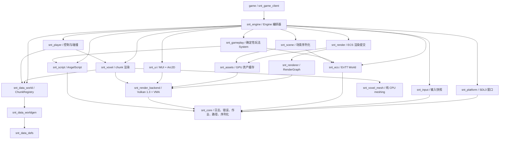

# ScienceAndTheology 自研引擎架构设计

> 当前架构基线，更新于 2026-07-10。
>
> 核对范围：2026-07-10 当前工作区；固定的引擎子模块基线为 `9af2c001a0d15fc6976999f6ad824f30a0c0c678`，并已核对 P7.2.1 gameplay 变更。
> 本文只描述顶层 CMake 实际构建的自研引擎链；`src/`、Godot 场景、GDScript 和 GDExtension 是迁移来源，不是当前运行时架构。

## 1. 结论

自研引擎的技术方向可以继续：C++20、SDL3、Vulkan 1.3、EnTT、AngelScript、保留模式 UI、显式宿主路径和独立引擎仓库之间没有根本冲突。当前最有价值的设计是：

- 游戏宿主拥有可执行程序、内容和打包，引擎只提供静态库。
- `RuntimePaths` 显式区分 `engine_root`、`game_root` 和 `user_root`，引擎不猜测源码目录。
- Vulkan 后端、RenderGraph、ECS 渲染、纯 voxel meshing 已分层。
- `Expected<T>`、错误上下文和分频道日志构成了统一的失败诊断路径。
- AngelScript 热重载采用 `ScriptId`、值拷贝注册和事务回滚，不保存跨重载 VM 指针。
- `EntityGuid` 与运行时 `entt::entity` 分离，为场景和存档提供稳定身份。

问题不在技术选型，而在模块契约和运行时组合仍停留在原型阶段：

| 优先级 | 问题 | 当前影响 |
| --- | --- | --- |
| P0 | CMake 依赖声明与源码真实依赖不一致 | 模块可独立构建的假设不成立；全局 include 路径和最终聚合链接掩盖了漏依赖 |
| P0 | `SystemScheduler` 对共享 `World` fire-and-forget | 一旦接入主循环会产生数据竞争、tick 跨帧和关机悬空引用；当前未接入，所以并行 ECS 不能算已实现 |
| P1 | `Engine` 同时负责生命周期、资源接线、固定 tick、演示世界和玩法 UI | 初始化顺序脆弱，难以做无头服务端、集成测试和不同游戏会话 |
| P1 | `AssetManager`、`ScriptManager`、默认 Job System、路径配置均为进程全局状态 | 生命周期隐式，测试隔离差，未来编辑器多世界或重启会话容易串状态 |
| P1 | 引擎层混入演示背包/配方、固定相机 Guid 和游戏内容注册表 | “宿主拥有内容”的边界没有贯彻到底 |
| P1 | 网络只有头文件契约，音频尚不存在，无头模式没有运行时入口 | 文档不能把网络、音频或 dedicated server 写成现有能力 |
| P2 | 存档和场景仍保留旧版本读取/跳过逻辑 | 与“未正式发布，只保留最新接口”的项目原则冲突 |
| P2 | 大量 P1/P2/P3 阶段注释仍描述已经替换的实现 | 容易让维护者按过时路径继续开发 |

因此结论是：不需要推倒重来，但应先修正依赖与线程模型，再继续扩大玩法迁移。继续向当前 `Engine` 中直接添加系统，会快速放大生命周期和边界问题。

## 2. 仓库和所有权边界

### 2.1 当前构建入口

顶层只构建两个子项目：

```text
ScienceAndTheology/
├── CMakeLists.txt                 # 添加 snt_engine 和 game
├── game/                          # 游戏宿主、配置、场景、脚本和打包
│   ├── client/main.cpp            # 唯一游戏可执行程序入口
│   ├── config/
│   ├── scenes/
│   └── scripts/
└── snt_engine/                    # 独立 Git 子模块，C++20 运行时库
```

旧 `src/`、`scripts/`、`project.godot`、`*.tscn` 和 GDExtension 文件不进入当前顶层 CMake 构建。它们只能作为迁移参考；迁移完成的旧接口应删除，不增加兼容层。

### 2.2 宿主职责

`game/client/main.cpp` 负责：

1. 定位可执行程序目录。
2. 构造 `RuntimePaths`。
3. 从 `game/config/engine.json` 读取配置。
4. 创建 `snt::engine::Engine`，调用 `init`、`run`、`shutdown`。
5. 由 `game/CMakeLists.txt` 将着色器、ICU 数据、场景、脚本和游戏资产组装到运行包。

运行包契约：

| 路径 | 所有者 | 内容 |
| --- | --- | --- |
| `<exe>/engine/` | 引擎 | SPIR-V 着色器、ICU 数据等只读资源 |
| `<exe>/game/` | 游戏 | 配置、场景、AngelScript 和游戏资产 |
| `<exe>/user/` | 用户数据 | 日志、存档和缓存，可写 |

引擎不得访问游戏源码树、父目录或 `snt_engine` 子模块名来推断路径。

## 3. 当前模块图

下图表示当前主要 CMake 目标的实际职责。箭头表示“使用/链接”，不是目标状态中的理想纯分层。



### 3.1 模块现状

| 模块/目标 | 当前职责 | 状态和边界 |
| --- | --- | --- |
| `snt_core` | 日志、`Expected/Error`、时钟、Job System、路径、配置、二进制 IO、UUID | 已实现；部分服务仍为全局状态 |
| `snt_platform` | SDL3 窗口、事件轮询、鼠标锁定、Vulkan surface | 已实现；当前仅 Windows 开发环境被正式支持 |
| `snt_input` | SDL 事件转输入快照 | 已实现；公共头依赖 `core/events.h` |
| `snt_render_backend` | Vulkan instance/device/swapchain/frame、descriptor、pipeline、buffer | 已实现原型；仍暴露较多 Vulkan 类型 |
| `snt_renderer` | RenderGraph、pass、资源状态、瞬态池、pipeline cache | 已实现并被 `RenderSystem` 使用 |
| `snt_assets` | manifest、稳定 handle、mesh/texture/shader/font 相关缓存 | 部分实现；核心 manager 直接借用 Vulkan device，尚非后端无关资产层 |
| `snt_ecs` | `World`、稳定 Guid、组件、System、EventBus、`SystemScheduler` | 基础已实现；运行时仍用 `World::update`，并行 scheduler 未接入且当前不安全 |
| `snt_render` | 读取 `Transform + MeshRef` 并构造 RenderGraph pass | 已实现 |
| `snt_scene` | 二进制场景 v1，保存/加载 Transform、MeshRef、Camera | 已实现，header-only；不是完整游戏存档 |
| `snt_ui` | Unicode 文本、保留模式 View、Arc2D、Vulkan UI renderer | 基础已实现；同时混有游戏背包/合成 ViewModel 和演示数据 |
| `snt_data_defs` | chunk、方块实体、生态、玩法配置等值类型 | 已实现，明显面向 ScienceAndTheology，不是通用引擎数据层 |
| `snt_data_worldgen` | noise、世界生成配置、地形生成 | 已实现 |
| `snt_data_save` | region、chunk serializer、压缩、世界/星球存档 | 已实现；当前仍读取部分旧格式 |
| `snt_data_mobile` | 飞船/动态结构和局部网格 | 已实现但未由 `Engine` 主链编排 |
| `snt_data_world` | `ChunkRegistry` 和 world ECS context | 已实现为 INTERFACE 目标 |
| `snt_voxel_mesh` | greedy meshing 和碰撞面生成 | 已实现，纯 CPU，可用于无渲染测试 |
| `snt_voxel` | chunk remesh/upload/draw | 已实现，依赖 Vulkan、ECS 和 world data |
| `snt_player` | 第一人称控制、voxel 碰撞和 DDA 射线 | 已实现 |
| `snt_script` | AngelScript VM、loader、watcher、binding、事务注册表 | P7.1 能力已实现；玩法 API 目前限于配方、机器、任务、事件和会话状态 |
| `snt_gameplay` | `MachineTickSystem`、机器运行态、配方快照和事件 sink | P7.2.1 已接入 `World::update`；按稳定 Guid 顺序单线程 tick |
| `snt_network` | `IReplicationTransport`、`ReplicationService` 声明 | 仅 `network/replication.h`，没有 CMake 目标和实现 |
| `snt_audio` | 计划中的音频服务 | 不存在 |
| `snt_engine` | 所有子系统生命周期和主循环 | 可运行，但职责过多且包含演示/游戏内容 |
| `snt_tests` | 单一 GoogleTest 可执行程序 | 覆盖 core、asset、script、gameplay、ECS、scene、data、player、UI；不覆盖完整 Engine/Vulkan 启停 |
| `gen_default_scene`、`engine_test` | 场景生成和数据/ECS smoke benchmark | 已实现 |

### 3.2 CMake 依赖缺口

`snt_engine_settings` 把引擎源码根目录作为所有目标的 PUBLIC include 目录，因此源码即使没有声明直接依赖也能找到其他模块头文件。静态库又允许未解析符号延迟到最终可执行程序，导致聚合构建成功但模块隔离失真。

已确认的缺口：

| 目标 | 源码真实直接依赖 | 当前 CMake 缺少 |
| --- | --- | --- |
| `snt_input` | `core/events.h` | `snt_core` |
| `snt_ecs` | `core/*`、`assets/asset_handle.h` | `snt_core`、`snt_assets`，或把纯 handle 类型下沉到 core |
| `snt_render_backend` | `core/expected.h`、`core/log.h`、`platform/window.h` | `snt_core`、`snt_platform` |
| `snt_voxel` | 多个 `core/*` 公共/实现头 | 显式 `snt_core`，不能只依赖传递链接 |
| `snt_gameplay` | 实现直接使用 `core/log.h`，公共头只暴露 ECS 类型 | `snt_core` 应为 PRIVATE 直接依赖；`snt_script` 可收窄为 PRIVATE |

修正规则：

1. 每个 `#include "module/..."` 必须对应直接 CMake 依赖。
2. 公共头暴露的依赖用 `PUBLIC`，只在 `.cpp` 使用的依赖用 `PRIVATE`。
3. 模块 include 目录应逐步收窄；不能依赖引擎根目录掩盖漏声明。
4. CI 增加逐目标构建，例如单独构建 `snt_ecs`、`snt_render_backend` 和 `snt_voxel_mesh`。
5. `snt_engine` 作为聚合 facade 可以链接所有运行时模块，但不能替代各模块自己的依赖声明。

## 4. 当前运行时

### 4.1 初始化和关闭

当前 `Engine::init` 的主要顺序是：

```text
RuntimePaths
  -> Job System + 文件日志
  -> AngelScript + gameplay scripts
  -> SDL Window + Input EventBus
  -> Vulkan instance/surface/device
  -> AssetManager
  -> swapchain/depth/descriptor/pipeline/frame
  -> binary scene + camera Guid=1
  -> RenderSystem + RenderGraph
  -> voxel renderer + demo world
  -> player controller
  -> retained gameplay UI
```

`shutdown` 以大致相反顺序释放。GPU 资产必须先于 Vulkan device 释放，Job System 必须最后停止。现有顺序由 `Engine::Impl` 字段和手写代码共同维持，没有模块依赖图自动校验。

### 4.2 帧和 tick

当前真实执行模型：

- 主线程轮询 SDL、更新 `InputState`、脚本 watcher、UI 和渲染。
- `Engine` 使用固定 20 TPS、每帧最多补 5 tick；超出后直接丢弃剩余时间债务并输出聚合性能数据。
- 每个逻辑 tick 调用 `World::update(0.05f)`，系统按注册顺序单线程执行。
- RenderGraph 每帧运行，和逻辑 tick 分离。
- `SystemScheduler` 有测试，但没有接入 `Engine`。

这意味着当前可声称“固定步长逻辑 + 多线程 Job System”，不能声称“ECS System 已安全并行”。

### 4.3 线程约束

在新的调度契约完成前，采用以下硬规则：

| 对象/操作 | 允许线程 |
| --- | --- |
| SDL 窗口、输入事件、AngelScript reload、EnTT `World` 结构变更 | 主线程 |
| Vulkan 提交、GPU 资源创建/销毁、UI draw data 合并 | 渲染主线程 |
| 日志写入 | 任意线程，Logger 内部串行化 |
| world generation、greedy meshing 等纯计算 | worker，但输入必须是不可变快照，结果通过队列回主线程提交 |
| worker 直接持有 `World&` 并异步写入 | 禁止 |

`SystemScheduler` 在具备以下能力前不得接入主循环：

- System 声明读/写资源集合和线程亲和性。
- 调度器根据冲突建立依赖图。
- 固定 tick 结束前有明确 barrier，不允许任务跨 tick。
- shutdown 等待所有引用 runtime/world 的任务。
- 结构变更使用 command buffer，在 barrier 后统一提交。
- 对超时、积压和冲突降级输出低频聚合日志。

## 5. 数据、场景和资产

### 5.1 场景与世界存档是不同域

| 域 | 当前格式 | 用途 |
| --- | --- | --- |
| Scene | `SNTS` v1 | 启动实体模板，目前只有 Transform、MeshRef、Camera |
| World save | universe header + planet data + region files | chunk、星球摘要和长期世界数据 |
| Script `StateStore` | 内存 map | 只跨脚本 reload，不跨进程持久化 |

不得把 Scene 当世界存档，也不得把 `StateStore` 当玩家持久化状态。P7 的机器/任务进度应进入 save 域，并以稳定内容 key 而不是运行时指针或 VM 对象持久化。

### 5.2 版本策略

项目尚未正式发布，目标策略是只保留最新格式：

- 写入端只写当前版本。
- 读取端遇到非当前版本立即返回结构化错误并记录一次版本号、路径和拒绝原因。
- 不维护旧版本迁移器、旧字段兼容和静默跳过。
- 开发期格式升级时，同步重生成测试资产和场景文件。

当前代码仍有例外：`ChunkSerializer` 可读 v4-v9，`SaveManager` 会统计 legacy region，Scene 会跳过未知组件。后续清理应删除这些兼容分支，而不是继续扩展。

### 5.3 资产边界

当前 Mesh handle 是稳定的值类型，但 `AssetManager` 本身直接依赖 Vulkan device。建议把资产分成两个层次：

```text
Asset catalog/source
  - path、manifest、稳定 ID、文件读取、依赖关系
  - 不依赖 Vulkan

GPU asset residency
  - mesh/texture/shader 上传、缓存、销毁和热重载
  - 依赖 render device，遵守渲染线程
```

这样无头服务端仍能读取内容清单和碰撞数据，而不需要创建 Vulkan device。

## 6. ECS 和玩法边界

### 6.1 当前 ECS

`snt::ecs::World` 包装 EnTT registry，负责：

- 创建/销毁实体。
- `EntityGuid <-> entt::entity` 双向映射。
- 组件访问和 view。
- 按注册顺序执行 `System::update(World&, dt)`。

当前 `components.h` 同时放置通用表现组件和玩法组件：Transform、Camera、MeshRef、Position、Velocity、Health、Inventory 和 marker。为了减少依赖，应拆成：

- `ecs/core_components.h`：Guid、Position、Velocity 等不依赖资产/渲染的组件。
- `render/render_components.h`：Transform、Camera、MeshRef。
- 游戏模块：Health、Inventory、玩家/生物/机器 marker。

这样 `snt_ecs` 不再依赖 `snt_assets`，headless world 也不会被 GPU 资产类型污染。

### 6.2 Script API 的真实范围

当前 `RegistryHub` 已提供：

- Recipe、Machine、Quest 定义注册。
- Event listener 的稳定 `(ScriptId, callback_id)` 表示。
- 按 `ScriptId` 隔离的会话状态。
- `begin_reload`、`commit_reload`、`rollback_reload` 事务。
- 内建定义回退和确定性 map 枚举。

尚未实现的其他机器类型、任务进度存档、网络 replication 和大量旧玩法接口，不属于当前 Script API。详细迁移顺序见 [p7_玩法迁移设计.md](p7_玩法迁移设计.md)。

### 6.3 P7.2.1 机器运行态

`snt_gameplay::MachineTickSystem` 已接入 `World::update`：

- 按稳定 `EntityGuid` 排序，保证运行和事件顺序确定。
- 开工时复制 `RecipeDefinition` 为 `MachineRecipeSnapshot`，脚本 reload 只影响新任务。
- 输入在开工时预扣；能量不足和输出阻塞保留进度，不丢物品。
- `IMachineTickEventSink` 是 UI、任务、存档脏标记和 replication 的预留接口。
- 状态异常及恢复只记录状态变化日志，不记录每 tick 或每次完成日志。

## 7. 目标运行时接口

下面是需要先声明、再逐步实现的架构接口。名称是目标契约，不代表当前源码已经存在。

```cpp
enum class ThreadAffinity {
    Main,
    Render,
    Worker,
};

struct ModuleAccess {
    std::span<const ResourceId> reads;
    std::span<const ResourceId> writes;
    ThreadAffinity affinity = ThreadAffinity::Main;
};

class IRuntimeModule {
public:
    virtual ~IRuntimeModule() = default;
    virtual ModuleId id() const noexcept = 0;
    virtual std::span<const ModuleId> dependencies() const noexcept = 0;
    virtual ModuleAccess access() const noexcept = 0;
    virtual Expected<void> init(RuntimeServices& services) = 0;
    virtual void fixed_tick(FixedTickContext& context) = 0;
    virtual void frame(FrameContext& context) = 0;
    virtual void shutdown() noexcept = 0;
};

class IGameSession {
public:
    virtual ~IGameSession() = default;
    virtual Expected<void> register_content(RuntimeServices& services) = 0;
    virtual Expected<void> create_world(WorldSession& world) = 0;
    virtual void fixed_tick(FixedTickContext& context) = 0;
    virtual void build_ui(UiContext& context) = 0;
    virtual void shutdown() noexcept = 0;
};
```

`RuntimeServices` 应由 `Engine` 实例拥有，显式提供 clock、logger、jobs、assets、scripts 和 paths；模块通过引用获得服务，不再自行访问新的全局 singleton。

已经存在并应保留的预留契约：

- `IReplicationTransport`：传输只收发 frame，不直接改 World。
- `ReplicationService`：协议版本和主线程应用边界。

仍需声明但暂不实现的契约：

- `IAudioDevice` / `IAudioScene`：避免玩法代码直接依赖 miniaudio。
- `IAssetSource` / `IGpuAssetUploader`：拆开内容读取与 GPU residency。
- `IWorldCommandQueue`：worker 和网络线程只提交命令，主线程在 tick barrier 应用。
- `IRuntimeObserver`：编辑器、性能面板和测试读取生命周期/性能快照，不获得可写子系统指针。

## 8. 需要选择的方案

### 8.1 Engine 与游戏内容边界

| 方案 | 优点 | 缺点 |
| --- | --- | --- |
| A. 保持专用单体 `Engine` | 改动最少，短期迭代最快 | 无头、测试、编辑器和多会话难做；游戏内容继续污染引擎 |
| B. `Engine Runtime + IGameSession` | 边界清晰；演示内容和玩法 UI 可移到 game；适合 dedicated server | 需要重排初始化、配置和依赖注入 |
| C. 所有模块动态插件化 | 最大扩展性，可按需加载 | 当前规模明显过度设计，ABI 和卸载顺序成本高 |

建议采用 B；A 可作为短期状态，C 不建议。最终选择由项目负责人确认。

### 8.2 ECS 并行策略

| 方案 | 优点 | 缺点 |
| --- | --- | --- |
| A. 继续单线程固定 tick | 确定性强，容易诊断，当前即可用 | CPU 扩展上限较低 |
| B. 资源访问声明 + DAG + tick barrier | 能安全并行，依赖关系可观测 | 调度器和 System 元数据需要重写 |
| C. 共享 World 外层加锁 | 实现看似快 | 高竞争、死锁风险、顺序不确定，掩盖错误依赖 |

在 B 完成前应保持 A；C 不建议。

### 8.3 渲染抽象范围

| 方案 | 优点 | 缺点 |
| --- | --- | --- |
| A. 明确只支持 Vulkan，不做通用 RHI | 代码少，充分使用 Vulkan 1.3，符合当前目标 | 无法直接增加 D3D12/Metal 后端 |
| B. 只抽象 GPU asset uploader 和 frame/pass 接口 | 支持 headless 和测试替身，不隐藏 RenderGraph | 仍需设计一层窄接口 |
| C. 完整跨 API RHI | 后端可替换 | 工作量大，容易退化成最低公分母 |

建议保留 Vulkan 专用后端，同时做 B 的窄边界；不做 C。

## 9. 日志、错误和可观测性

当前 Logger 支持级别过滤、模块频道、线程安全 stderr、滚动文件。`Engine::init` 将文件日志写入 `user/logs/engine.log`。后续继续遵守：

- 不确定的生命周期、依赖顺序和异步状态优先用低频日志确认。
- init/shutdown、reload 事务、存档拒绝、协议拒绝、任务积压输出 Info/Warn/Error。
- 不记录每帧、每实体、每 voxel 或每 glyph 的 Info 日志。
- 高频数据使用计数器/直方图聚合，每秒或状态变化时输出一次。
- 可恢复失败返回 `Expected<T>` 并追加上下文；日志放在最终处理边界，避免同一错误逐层重复打印。
- Fatal 只用于无法继续且即将终止的状态。

建议新增的低频诊断：

- 模块初始化/关闭顺序和耗时。
- 每秒 fixed tick 数、丢弃 tick 债务次数和最长 tick。
- Job queue 深度、等待 barrier 超时和 worker 降级次数。
- 脚本 reload 的 ScriptId、事务结果和耗时。
- 存档/场景版本拒绝的路径、读到版本和期望版本。
- replication 协议版本、peer 和拒绝原因。

## 10. 实施顺序

1. **依赖基线**：修正 CMake 直接依赖，收窄 include path，增加逐目标构建检查。
2. **线程基线**：明确 `SystemScheduler` 暂不接入；补资源访问声明、barrier、shutdown wait 和结构变更 command buffer。
3. **运行时边界**：声明并落地 `RuntimeServices`、`IRuntimeModule`、`IGameSession`，把 demo bootstrap、固定 Guid 和玩法 UI 移到 game。
4. **消除新全局状态**：先让 Engine 显式拥有 Asset/Script/Job 服务；旧 singleton 直接删除，不保留兼容入口。
5. **数据边界**：拆分 ECS core/render/game components，拆分 asset catalog 与 GPU residency。
6. **最新格式策略**：删除旧 scene/save 读取分支，升级时重生成开发资产。
7. **无头与网络**：先让纯 simulation runtime 不创建 SDL/Vulkan，再实现 replication transport。
8. **音频**：先声明 `IAudioDevice`/`IAudioScene`，确认线程和资源所有权后再引入 miniaudio。

## 11. 能力状态

| 能力 | 状态 |
| --- | --- |
| 游戏宿主、显式运行时路径、资源打包 | 已实现 |
| SDL3 窗口和输入 | 已实现 |
| Vulkan 1.3 后端和 RenderGraph | 已实现原型 |
| EnTT World、稳定 Guid、基础组件 | 已实现 |
| 固定 20 TPS 单线程模拟 | 已实现 |
| 安全并行 ECS 调度 | 未实现，现有 scheduler 不可直接接入 |
| 数据定义、世界生成、region 存档 | 已实现，仍需清理兼容分支 |
| voxel meshing、chunk 渲染、玩家碰撞/射线 | 已实现 |
| 保留模式 UI、Unicode shaping/raster | 已实现基础能力 |
| AngelScript 加载、watch、事务热重载 | 已实现 P7.1 |
| 炉子 `MachineTickSystem`、reload-safe 配方快照 | 已实现 P7.2.1 |
| 其余玩法迁移和持久状态 | 未完成 |
| 网络 replication | 仅接口声明 |
| dedicated/headless server | 未实现 |
| 音频 | 未实现 |
| 编辑器 | 不在当前范围；保留观察/工具接口，不建设完整编辑器 |

## 12. 文档维护规则

- 架构状态以 CMake 目标和当前公开头文件为准，不以阶段编号或计划目录为准。
- “已实现”必须能指向参与构建的目标和测试；只有头文件声明时写“接口声明”。
- 子模块接口变化先更新引擎仓库文档和测试，再更新游戏仓库的子模块指针与本文件基线。
- 设计取舍记录方案、优缺点、最终决定和日期；未决定的方案不得伪装成现状。
- 模块级头文件和 CMake 文件应有职责、依赖方向、线程和所有权注释。
- 新接口只保留最新版本；旧 API、旧命名和兼容 wrapper 应随调用方迁移一起删除。

## 13. 变更记录

- 2026-07-10：按实际子模块代码重写。删除过时的 P0-P7 完成度、Godot 主链、未实现的完整脚本 API 和错误目录树；补充真实模块图、线程风险、CMake 依赖缺口、目标接口和决策选项。
- 2026-07-08：脚本方案确定为 AngelScript。
- 2026-07-06：确定 EnTT ECS 和 Manager 向 System 迁移方向。
