# ScienceAndTheology 项目架构与运行时基线

> 当前架构基线，更新于 2026-07-17。
>
> 当前工作区包含 `SimulationRuntime + ISimulationSession`、`ClientRuntime + IClientSession`、`snt_game_server`、`snt_network`、`snt_game_identity`、`snt_game_network`、game-owned P7.2.4 多输入/手动激活机器运行态、activation context 边界与原始工业内容、P7.3 `QuestRegistry`、结构化 reward 与 committed event/reward bridge、P7.4 task progress provider、dedicated-server 玩家生命周期、共享世界存档生命周期与 chunk-sidecar 机器恢复/保存、P7.5 `SNTG` v8 snapshot/delta/movement/block-interaction/quest-claim/typed account-value codec、budgeted provider scheduling、concrete player AOI/source、server-owned movement 和只读任务书缓存，以及主机权威/客户端可信提示的方块、机器和任务奖励领取、sidecar 床/墓碑/重生服务、P0 CMake 依赖隔离和 A 方案 voxel/game world 数据边界变更。
> 本文只描述顶层 CMake 实际构建的自研引擎链；`src/`、Godot 场景、GDScript 和 GDExtension 是迁移来源，不是当前运行时架构。

Science & Theology 是一款 C++20 Vulkan 3D 体素工厂、探索与魔法游戏。本文是项目当前架构、运行时边界和能力状态的唯一基线，替代原有的项目总览与独立引擎架构说明；构建和运行命令保留在仓库根目录的 `README.md`，旧项目删除条件保留在 [旧项目迁移与清理.md](旧项目迁移与清理.md)。

存档只读写最新格式：游戏 chunk payload 当前为 v13，engine raw region framing 当前为 v2。格式升级时同步更新测试与开发资产，旧格式直接拒绝，不保留兼容读取或离线转换器。

## 1. 结论

自研引擎的技术方向可以继续：C++20、SDL3、Vulkan 1.3、EnTT、AngelScript、保留模式 UI、显式宿主路径和独立引擎仓库之间没有根本冲突。当前最有价值的设计是：

- 游戏宿主拥有可执行程序、内容和打包，引擎只提供静态库。
- 宿主输入的 `RuntimePaths` 显式区分 `engine_root`、`game_root` 和 `user_root`；`SimulationRuntime` 将其规范化为实例拥有的 `RuntimePathResolver`，引擎不猜测源码目录，也不保存进程全局根目录。
- Vulkan 后端、RenderGraph、ECS 渲染、纯 voxel meshing 已分层。
- `Expected<T>`、错误上下文和分频道日志构成了统一的失败诊断路径。
- AngelScript 热重载采用 `ScriptId`、值拷贝注册和事务回滚，不保存跨重载 VM 指针。
- `EntityGuid` 与运行时 `entt::entity` 分离，为场景和存档提供稳定身份。
- `SimulationRuntime` 以 `SimulationServices`、`SimulationWorldSession` 和 `ISimulationSession` 拥有确定性游戏生命周期；`ClientRuntime` 组合它并以 `IClientSession` 承担 SDL/Vulkan、输入、场景、相机和 UI。

问题不在技术选型，而在模块契约和运行时组合仍停留在原型阶段：

| 优先级 | 问题 | 当前影响 |
| --- | --- | --- |
| P0 | `SimulationRuntime` 已通过 `SystemScheduler` 运行生产 ECS 系统，game-owned `MachineTickSystem` 与 `PlayerPhysicsSystem` 已进入独立 worker 路径 | 已消除 `World::update` 绕过调度器的路径；机器系统在单个 task 内按稳定顺序分片，玩家碰撞只消费值快照；两个任务的资源声明无冲突，可在同一 barrier 前并发 |
| P1 | 体素世界数据边界已按 A 方案完成首轮迁移 | 引擎只保留 `snt_voxel_data` 与 `snt_voxel_storage`；方块实体、生态、物种、生成、语义化存档和移动结构由 `game/` 目标拥有 |
| P1 | 游戏账号身份、`SNTG` v8、登录准入、客户端 local-name 连接闭环、权威 QuestAccept/QuestClaimReward、已提交任务 event/reward bridge、主机权威/客户端可信提示的 BlockInteraction、UDP movement intent、任务/玩家存档生命周期、player AOI snapshot/delta、remote-player value world 与认证账号任务书只读值同步已实现；Steamworks 平台 backend、任务书 UI、机器放置、chunk/machine source、remote avatar rendering 尚不存在，音频尚不存在 | `snt_game_identity` 以 `steam:<SteamID64>` / `local-name:<name>` 隔离账号；`snt_game_network` 已实现 typed login/command/movement/snapshot/delta codec、会话接管、budgeted `GameServerReplicationHandler` 与可注入 transport 的 `GameClientReplicationSession` value drain；`GameServerPlayerMovement` 以输入、碰撞和 gravity 产生权威位置，`GameServerPlayerReplication` 从 server ECS 值和 typed value source 生成 AOI/delta baseline，`GameRemotePlayerWorld` 与 `GameClientQuestBookState` 应用 presentation-only 值；server composition 还拥有 sidecar bed/grave/respawn/death、block/machine interaction 与 quest event/reward services，战斗 death producer 尚未接入 |
| P2 | 部分 P1/P2/P3 阶段注释仍描述已经替换的实现 | 容易让维护者按过时路径继续开发 |

因此结论是：不需要推倒重来。确定性玩法内容必须进入 `ISimulationSession`，客户端场景/输入/UI 只能进入 `IClientSession`；两类内容都不能写回引擎 runtime。SimulationRuntime 已使用安全调度契约，后续应只把能够提供值快照和确定性写回的纯计算系统迁移到 worker，并继续收敛游戏内容边界。

## 2. 仓库和所有权边界

### 2.1 当前构建入口

顶层只构建两个子项目：

```text
ScienceAndTheology/
├── CMakeLists.txt                 # 添加 snt_engine 和 game
├── game/                          # 游戏宿主、配置、场景、脚本和打包
│   ├── client/main.cpp            # 图形客户端入口
│   ├── server/main.cpp            # 无头服务端入口
│   ├── runtime/                   # 共用运行包定位与配置读取
│   ├── simulation/                # 共用确定性游戏会话
│   ├── config/
│   ├── scenes/
│   └── scripts/
└── snt_engine/                    # 独立 Git 子模块，C++20 运行时库
```

旧 `src/`、`scripts/`、`project.godot`、`*.tscn` 和 GDExtension 文件不进入当前顶层 CMake 构建。它们只能作为迁移参考；迁移完成的旧接口应删除，不增加兼容层。

### 2.2 宿主职责

`game/runtime/runtime_package.*` 负责定位可执行程序、构造 `RuntimePaths`，并从 `game/config/engine.json` 读取 `RuntimeConfig` 与游戏会话配置。两个宿主在此基础上分别负责：

1. `game/client/main.cpp` 创建 `ScienceAndTheologyClientSession` 与 `snt::engine::ClientRuntime`，并把 `IClientSession` 所有权移交给 ClientRuntime。
2. `game/server/main.cpp` 创建 `ScienceAndTheologyServerSession` 与 `snt::engine::SimulationRuntime`；`--ticks N` 用于确定性运行包自检，`--network`（或配置）启用 TCP+UDP，不带参数时进入固定 tick 循环。
3. `game/CMakeLists.txt` 分别组装客户端所需的 shader/ICU/scene 和两个宿主共用的 game content；服务端只创建空的 `engine/` 根，不复制 SDL/Vulkan 资源。

运行包契约：

| 路径 | 所有者 | 内容 |
| --- | --- | --- |
| `<exe>/engine/` | 引擎 | SPIR-V 着色器、ICU 数据等只读资源 |
| `<exe>/game/` | 游戏 | 配置、场景、AngelScript 和游戏资产 |
| `<exe>/user/` | 用户数据 | 日志、存档和缓存，可写 |

引擎不得访问游戏源码树、父目录或 `snt_engine` 子模块名来推断路径。

## 3. 当前模块图

下图表示当前主要 CMake 目标的实际职责。箭头表示“使用/链接”，不是目标状态中的理想纯分层。

```mermaid
flowchart TD
    ClientHost["game / snt_game_client"] --> Client["snt_client_runtime / ClientRuntime"]
    ServerHost["game / snt_game_server"] --> Simulation["snt_simulation_runtime / SimulationRuntime"]
    ClientHost --> ClientSession["game / ScienceAndTheologyClientSession"]
    ServerHost --> ServerSession["game / ScienceAndTheologyServerSession"]
    ClientSession --> SimulationGameSession
    Client --> Simulation["snt_simulation_runtime / SimulationRuntime"]
    Client --> ClientContract["IClientSession / client callbacks"]
    Simulation --> SimulationContract["ISimulationSession / fixed tick"]
    ClientContract -. extends .-> SimulationContract
    ClientSession --> ClientContract
    SimulationGameSession --> SimulationContract
    ServerSession --> SimulationGameSession
    ServerSession --> Network["snt_network / replication + TCP/UDP + Steam adapter"]

    Client --> Platform["snt_platform / SDL3 窗口"]
    Client --> Input["snt_input / 输入快照"]
    Client --> Render["snt_render / ECS 渲染提交"]
    Client --> UI["snt_ui / MUI + Arc2D"]
    Client --> Voxel["snt_voxel / chunk 渲染"]
    Client --> GpuAssets["snt_gpu_assets / Vulkan 常驻"]
    Simulation --> ECS["snt_ecs / EnTT World"]
    Simulation --> Script["snt_script / AngelScript"]
    Simulation --> AssetContent["snt_asset_content / source + catalog + stable ID"]
    Simulation --> VoxelData["snt_voxel_data / terrain + ChunkRegistry"]
    Simulation --> VoxelStorage["snt_voxel_storage / raw region framing"]
    ClientSession --> Player["snt_player / 控制与碰撞"]
    ClientSession --> Scene["snt_scene / 场景序列化"]
    SimulationGameSession --> GameContent["game/client/game_content_registry / 定义、状态、snt_* 绑定"]
    SimulationGameSession --> GameMachine["game/client/machine_tick_system / 确定性机器玩法"]
    ClientSession --> GameUi["game/client/gameplay_ui / 背包、合成、性能面板"]
    SimulationGameSession --> GameWorldGen["snt_game_worldgen / ScienceAndTheology 生成规则"]
    GameUi --> UI
    GameContent --> Script
    GameMachine --> ECS
    GameMachine --> GameContent

    Render --> Renderer["snt_renderer / RenderGraph"]
    Render --> GpuAssets
    Renderer --> Backend["snt_render_backend / Vulkan 1.3 + VMA"]
    GpuAssets --> AssetContent
    GpuAssets --> Backend
    UI --> Backend
    Voxel --> Backend
    Voxel --> VoxelMesh["snt_voxel_mesh / 纯 CPU meshing"]
    Voxel --> VoxelData
    Player --> Voxel
    Player --> VoxelData
    Scene --> ECS
    Scene --> AssetContent
    GameWorldGen --> GameWorldData["snt_game_world_data / sidecars + 玩法定义"]
    GameWorldGen --> VoxelData
    GameSave["snt_game_world_save / v13 game payload"] --> GameWorldData
    GameSave --> VoxelStorage["snt_voxel_storage / v2 raw region framing"]
    GameMobile["snt_game_world_mobile / 飞船与动态结构"] --> GameWorldGen
    GameMobile --> VoxelData
    Core["snt_core / 日志、错误、作业、路径、序列化"]
    Platform --> Core
    Input --> Core
    ECS --> Core
    Backend --> Core
    Script --> Core
    Network --> Core
```



### 3.1 模块现状

| 模块/目标 | 当前职责 | 状态和边界 |
| --- | --- | --- |
| `snt_core` | 日志、`Expected/Error`、时钟、Job System、路径、配置、二进制 IO、UUID | 路径通过不可变 `RuntimePathResolver` 实例解析；Logger 仍是进程级诊断设施 |
| `snt_platform` | SDL3 窗口、事件轮询、鼠标锁定、Vulkan surface | 已实现；当前仅 Windows 开发环境被正式支持 |
| `snt_input` | SDL 事件转输入快照 | 已实现；公共头依赖 `core/events.h` |
| `snt_render_backend` | Vulkan instance/device/swapchain/frame、descriptor、pipeline、buffer | 已实现原型；仍暴露较多 Vulkan 类型 |
| `snt_renderer` | RenderGraph、pass、资源状态、瞬态池、pipeline cache | 已实现并被 `RenderSystem` 使用 |
| `snt_asset_content` | manifest/source、稳定 mesh identity、通用内容读取 | 只依赖 core/JSON；由 SimulationRuntime 拥有，独立目标不链接 SDL/Vulkan |
| `snt_gpu_assets` | GPU mesh residency、font/texture/shader presentation helpers | ClientRuntime 拥有 AssetManager，借用 SimulationRuntime 的 source/catalog 和 Vulkan device |
| `snt_render_components` | `Transform`、`Camera`、`MeshRef` 与对应序列化 | header-only presentation contract；场景和会话可使用它而不链接 Vulkan `RenderSystem` |
| `snt_ecs` | `World`、稳定 Guid、核心 `Position`/`Velocity`、System、EventBus、`SystemScheduler` | 只拥有与表现和玩法无关的 ECS 数据；不再链接 assets 或 input |
| `snt_render` | 读取 `Transform + MeshRef` 并构造 RenderGraph pass | 已实现 |
| `snt_scene` | 二进制场景 v1，保存/加载 Transform、MeshRef、Camera | 已实现，header-only；不是完整游戏存档 |
| `snt_ui` | Unicode 文本、保留模式 View、Arc2D、Vulkan UI renderer | 只保留通用 UI 原语和渲染后端；背包、合成、性能面板及试玩数据由 `game/client/gameplay_ui.*` 拥有 |
| `snt_voxel_data` | terrain cell、`VoxelChunk`、`ChunkKey`、`ChunkRegistry` | 引擎通用值类型；SimulationRuntime、renderer、player 只依赖此层，不含玩法 sidecar |
| `snt_voxel_storage` | raw region v2 framing、compaction、`IVoxelWorldStorage` 声明 | 引擎只保存不解释的 chunk payload bytes |
| `snt_game_world_data` | 方块实体、生态、物种、玩法配置、`GameChunkSidecarRegistry` | game-owned；与 `VoxelChunk` 以 `ChunkKey` 对齐 |
| `snt_game_worldgen` | noise、世界生成配置、地形和 sidecar 生成 | game-owned；返回临时 `GameChunk` 组合值 |
| `snt_game_world_save` | `GameChunkSerializer`、`GameSaveManager`、planet summary、`SNTQ`/`SNTP` player provider | 只接受完整 game payload v13；通过 raw v2 region framing 持久化，任务和 player provider 只交换值类型；v13 sidecar 同时保存床 anchor、墓碑 contents 与 in-flight 手动机器任务 owner |
| `snt_game_world_mobile` | 飞船、动态结构和局部网格 | game-owned；尚未由当前会话编排 |
| `snt_voxel_mesh` | greedy meshing 和碰撞面生成 | 已实现，纯 CPU，可用于无渲染测试 |
| `snt_voxel` | chunk remesh/upload/draw | 已实现，依赖 Vulkan、ECS 和通用 voxel data |
| `snt_player` | 第一人称输入/交互、voxel 碰撞、DDA 射线和玩家物理 worker | `PlayerControllerSystem` 保持主线程输入和方块编辑；`PlayerPhysicsSystem` 以 terrain 值快照在 worker 积分，barrier 写回 player state 与相机 |
| `snt_script` | AngelScript VM、loader、watcher、`IScriptContentHost` 事务协调 | 不再包含具体玩法定义或 `snt_*` binding；宿主必须在 `ScriptManager::init()` 前注入内容宿主 |
| `snt_game_identity` | stable player account id、local profile、Steam/client prompt contracts | game-owned 且 headless；local profile 为 `SNTI` v1，Steamworks adapter 只通过接口注入，不链接 Steam SDK |
| `snt_game_simulation` | `ScienceAndTheologySimulationSession`、游戏配置、脚本内容、机器 worker、QuestRegistry、world/machine persistence lifecycle、demo terrain/sidecar | client/server 共用且只链接 simulation 闭包；不含 SDL、Vulkan、scene、player 或 UI；会话在 demo bootstrap 前加载 current-format world、恢复锚定机器，并仅在 ready 状态关闭时 capture/save |
| `game/client/game_content_registry.*` | 配方、机器、结构化任务定义、事件、临时脚本状态和 `snt_*` binding | 由 `ScienceAndTheologySimulationSession` 拥有；保留内建回退、稳定 ScriptId、值拷贝、quest revision 与 reload 提交/回滚 |
| `game/client/machine_tick_system.*` | `MachineTickSystem`、机器运行态、配方快照和事件 sink | P7.2.4 由游戏拥有并作为 scheduler worker：主线程复制注册表/组件快照；大批机器在 worker 内分片计算，barrier 后主线程按 Guid 顺序写回；多输入、稳定 recipe id 选择与手动激活已用于炉子、pit kiln、charcoal pit、bloomery 和 anvil 内容 |
| `game/simulation/machine_interaction_service.*` | `MachineInteractionService`、trusted activation context | client/server 共用且只在 simulation main thread 调用；按 machine content 的 cover/ignition/structure/tool tag 前置条件排队 `WaitingForActivation` 请求，不接受 raw network payload、player entity 或 inventory 指针 |
| `game/world/defs/machine_structure_validator.*` | `MachineStructureValidator`、bloomery voxel structure check | 只读 `ChunkRegistry` 的 game-world 规则；验证 controller 周围 3x3x2 的 17 个 bloomery material cell，missing chunk、越界或 material 不符均 fail-closed；由未来 player-command 生成 activation context 时调用 |
| `game/quest/quest_registry.*` + `quest_progress.h` | per-player task state、objective/reward progress、reload reconciliation、稳定存档值接口和内存 revision | game-owned、simulation-main-thread-only；定义/进度/效果/持久化边界分离；`claim_reward()` 仅显式领取，item reward 要求 sink 原子提交，revision 仅在持久化值变化时递增 |
| `game/world/save/quest_progress_persistence.*` | `GameSaveManager` backed P7.4 per-player task persistence | `snt_game_world_save` 只依赖 `quest_progress.h` 值类型；无 simulation 反向依赖；caller 在玩家生命周期而非 tick 中调用 |
| `game/world/save/world_persistence_lifecycle.*` | 当前 dimension 的 world load/bootstrap/save 编排 | 只依赖 chunk/sidecar 与 `GameSaveManager`；不持有 ECS、脚本、transport 或 tick。验证 header、seed、mode、dimension；损坏世界拒绝启动且不覆盖 |
| `game/simulation/machine_runtime_persistence.*` | chunk-anchored machine runtime 的创建/移除、恢复与 capture | 只在 simulation main thread 调用；world sidecar 保存纯值 `MachineRuntimePersistenceRecord`，本模块验证 `BlockEntityPlacement(MACHINE)` anchor 后才接触 ECS，未锚定 live machine 拒绝保存 |
| `snt_network` | transport-neutral replication、wire codec、non-blocking TCP+UDP、Steam P2P adapter | 只依赖 `snt_core`（Windows 链接 `ws2_32`）；无 SDL/Vulkan/Steamworks SDK；Steam SDK 集成实现 `ISteamP2PBackend` 后注入 |
| `snt_game_network` | 游戏 `SNTG` v8 envelope、typed login/command/unreliable movement/snapshot/delta codec、client/server 准入 handler、认证/命令/AOI/source contracts、typed account value 与 player v1 value codec | game-owned 且 headless；`GameAccountPeerAuthenticator` 已允许 local-name 并让同 account 新登录接管旧 peer；handler 对注入 provider 执行严格 codec + bytes/chunk/entity/value/block per-peer budget + atomic queue，`GameClientReplicationSession` 以 shared sequence 发送 quest accept/claim/block-interaction command 和 movement，`GameRemotePlayerWorld` 与 `GameClientQuestBookState` 只应用有序 presentation value；Steam ticket verifier、chunk/machine source、remote avatar rendering 尚未接入 |
| `game/server/game_server_player_replication.*` | 同 dimension player AOI、per-observer snapshot/delta baseline、presentation-only entity source | dedicated-server composition-owned；只读取 `GameServerPlayerState` 值快照，不读取 client position/inventory；初始 snapshot 包含自身，disconnect/takeover 清理 observer baseline |
| `game/server/game_server_quest_book_replication.*` | 认证账号 `QuestBookSnapshot` value source | dedicated-server composition-owned；只读取 `QuestRegistry` 的 account-keyed 值，不能接受客户端进度，`GameServerPlayerReplication` 负责 value baseline 和 outbound budget |
| `game/server/game_server_command_sink.*` | `QuestAccept`、`QuestClaimReward` 与 `BlockInteraction` 的 shared session sequence、稳定排序、latest movement intent 合并、断线取消和任务状态 mutation | dedicated-server composition-owned；只借用 `QuestRegistry`、narrow movement input sink 与 interaction service，不持有 transport/ECS World；未知命令是协议拒绝，任务规则拒绝以低频聚合 Warn 记录 |
| `game/server/game_server_player_interaction.*` | 主机 world/inventory/bed/已锚定 machine 交互事务与 interaction event seam | dedicated-server composition-owned；客户端可提供射线、所选物品、挖掘和机器前置提示，主机仍提交 terrain、背包、sidecar 与 checkpoint 可见状态；只检查会话、dimension/reach、loaded chunk、目录、库存非负与 sidecar 完整性，不重放反作弊式 raycast/挖掘/机器前置条件 |
| `game/server/game_server_quest_events.*` | 已提交交互/机器事件到任务进度的 bridge，以及 item reward 主机库存事务 | dedicated-server composition-owned；只消费稳定 account id、值产物与提交后的库存，挖矿/放置/领取刷新 `acquire_item`、挖矿推进 `mine_block`、机器完成推进 `craft_item`；事件 producer 的 active-peer/库存查询失败以 20 tick 节流 Warn 丢弃，reward 事务错误返回领取调用方且不改任务领取位 |
| `game/server/game_server_player_movement.*` | authenticated intent、walk/sprint/jump/gravity、voxel collision、stale-input timeout 和 motion reset | dedicated-server composition-owned；只写 `GameServerPlayerState` 的权威 block-grid position，不读取 client position；连续状态是 online-only，不进入 `SNTP` |
| `game/server/game_server_player_death.*` | bed anchor、sidecar grave、death transaction、respawn resolver 和 direct grave collection | dedicated-server composition-owned；墓碑同时是 v13 sidecar record、`CUSTOM` block-entity anchor 和不可破坏 terrain cell；interaction service 与未来战斗 death producer 调用它，网络 payload 不直接改世界 |
| `game/server/game_server_player_lifecycle.*` | 认证玩家任务 load、顶号内存转移、断线/关服强制 save、quest revision 与显式 player-state dirty autosave | dedicated-server composition-owned；只借用 `QuestRegistry`、`GameSaveQuestProgressPersistence` 与 `GameSavePlayerStatePersistence`，不持有 transport/ECS World；`universe_save_dir` 由 server session 解析到 `user_root`，文件 I/O 仅在 after-fixed-tick barrier 的受控 checkpoint 或生命周期边界发生 |
| `snt_audio` | 计划中的音频服务 | 不存在 |
| `snt_simulation_runtime` | 路径、日志、content source/catalog、jobs、script、ECS、generic chunk 与 fixed tick | 只链接 simulation 闭包；公开 `ISimulationSession` / `SimulationServices` / `SimulationWorldSession` |
| `snt_client_runtime` | SDL/Vulkan、GPU assets、render/UI/chunk presentation 与 client callbacks | 组合 SimulationRuntime；公开 `IClientSession` / `ClientWorldSession` / frame/UI context |
| `snt_game_server` | 运行包定位、配置读取、`ScienceAndTheologyServerSession` 与 TCP+UDP/`snt_game_network`、权威 movement、bed/grave/death、block/machine interaction、命令和玩家生命周期组合 | 支持 `--ticks N`、`--network`、`--bind`、`--tcp-port`、`--udp-port`；不链接 SDL/Vulkan/client runtime；local-name 准入可用，任务/玩家状态位于 `user/saves/default`（可配置），Steam ticket 无 verifier 时明确拒绝，版本错误或不匹配的 gameplay frame 同样明确拒绝 |
| `snt_network_tests` | 独立网络 GoogleTest 可执行程序 | 覆盖 wire/version/size 拒绝、localhost 双向 TCP+UDP、`ReplicationService` 时序与 Steam fake backend；不链接 SDL/Vulkan |
| `snt_simulation_runtime_tests` | 独立模拟 Runtime GoogleTest 可执行程序 | 初始化、内容 catalog、固定 tick 和 shutdown；项目引用不含 SDL/Vulkan/client target |
| `snt_tests` | 独立引擎 GoogleTest 可执行程序 | 覆盖 core、asset、script、ECS、scene、通用 voxel data/storage、player、通用 UI、RuntimeConfig；不覆盖实际 ClientRuntime/Vulkan 启停 |
| `snt_game_tests` | game-owned GoogleTest 可执行程序 | 覆盖玩法 UI、内容注册、热重载、机器 worker、身份/profile、game simulation session 无头启动/tick、game replication envelope/准入，以及 game worldgen、sidecar、serializer 和 save split |
| `gen_default_scene`、`snt_game_world_test` | 场景生成和游戏 world/ECS smoke benchmark | 已实现 |

### 3.2 CMake 依赖隔离（已实现）

`snt_engine_settings` 现在只保留 C++ 标准、编译选项和全局编译定义；它不再向所有目标隐式导出引擎源码根目录。每个引擎模块在 `cmake/module_dependency_audit.cmake` 中注册自身的 build-interface include 根、源码范围和 `#include "module/..."` 前缀所有权。

配置期审计会扫描注册模块的 `.h`、`.hpp`、`.inl`、`.cpp` 和 `.cxx` 文件，将带引擎模块前缀的 quoted include 映射到唯一 CMake 目标，并验证该目标直接出现在消费者的 `target_link_libraries` 中。编译目标只能通过 `PUBLIC` 或 `PRIVATE` 使用实现依赖，header-only 目标才可使用 `INTERFACE`。任何遗漏都会在生成构建文件前失败，并报告消费者目标、源码位置、include 与缺失目标。当前基线覆盖 21 个引擎目标和 148 条内部 include 边；`network/` 已纳入同一检查。

`snt_voxel_mesh`、`snt_voxel_data`、`snt_voxel_storage` 与 `snt_voxel` 共用 `voxel/` 源码树但拥有不同的头文件所有权，因此注册表显式列出前缀和范围。新增共享目录中的公开头时必须同时更新其目标归属。game-owned `game/world/...` 不进入引擎模块审计；它通过显式 CMake target 直接链接 `snt_voxel_data` 或 `snt_voxel_storage`。

游戏层额外对 `snt_game_simulation` 与 `snt_game_server` 执行配置期 headless 断言：这两个目标不得直接链接 `snt_third_party`、ClientRuntime、SDL/platform/input、Vulkan/render、UI、voxel renderer 或 player target。游戏 simulation 只直接使用 `nlohmann_json`、AngelScript/script、core/ECS、generic voxel data 和 game world 目标；这样全量第三方聚合 target 不会重新把 SDL/Vulkan 带入服务端闭包。

本次修正的直接依赖如下：

| 目标 | 直接依赖 | 可见性 | 原因 |
| --- | --- | --- | --- |
| `snt_input` | `snt_core` | `PUBLIC` | `input_system.h` 暴露 `core/events.h` 类型 |
| `snt_ecs` | `snt_core` | `PUBLIC` | 公共 World/scheduler 使用 core 的错误、作业和命令类型；核心组件不再暴露资产句柄 |
| `snt_render_components` | `snt_core`、`snt_asset_content` | `INTERFACE` | 公开 serializer 与 `MeshRef` 使用 core 二进制 IO 和 canonical `MeshHandle` |
| `snt_render` | `snt_render_components` | `PRIVATE` | RenderSystem 实现解释 presentation 组件，公开 RenderSystem 头不暴露它们 |
| `snt_render_backend` | `snt_core` | `PUBLIC` | 公共 Vulkan 封装返回 core 的错误/结果类型 |
| `snt_render_backend` | `snt_platform` | `PRIVATE` | surface 创建实现使用 `Window` |
| `snt_voxel` | `snt_core`、`snt_voxel_data` | `PUBLIC` | 公开 chunk 系统使用作业、错误和 generic `VoxelChunk` 类型 |
| `snt_player` | `snt_voxel_data` | `PUBLIC` | `voxel_collision.h` 暴露 generic voxel collision world 所需的 chunk 类型 |

审计检查“是否直接声明”，不从 include 的可达性推导 `PUBLIC`/`PRIVATE`。可见性仍按公开头实际暴露的类型审查；这能避免把实现依赖误传递给宿主。`snt_simulation_runtime` 与 `snt_client_runtime` 都不享有审计豁免，也不会反向为下层模块提供头文件或链接依赖。

验证分三层执行：

1. 每次 CMake 配置自动运行依赖审计，未声明内部 include 立即失败。
2. CI 分别构建 `snt_core`、`snt_ecs`、`snt_simulation_runtime`、`snt_simulation_runtime_tests`、`snt_render_backend`、`snt_voxel_mesh`、`snt_voxel` 和 `snt_client_runtime`，再构建游戏宿主。
3. `snt_simulation_runtime_tests` 验证 simulation 闭包不含客户端依赖；`snt_tests` 覆盖其余独立引擎行为、通用 voxel storage 和显式内容宿主契约；`snt_game_tests` 覆盖宿主玩法 UI、内容注册、热重载、机器运行态与 game sidecar save/load；依赖审计只验证构建图，不以运行测试替代链接隔离。

不采用 `CMAKE_LINK_WHAT_YOU_USE` 作为唯一防线：它对静态库和 MSVC 的间接符号情况不能完整覆盖，也无法识别仅在公开头中泄漏的依赖。

## 4. 当前运行时

### 4.1 初始化和关闭

当前运行时分为两个显式生命周期。独立 `SimulationRuntime::init` 的主要顺序是：

```text
RuntimePaths -> RuntimePathResolver
  -> Job System + 文件日志
  -> FilesystemAssetSource(game_root)
  -> AssetCatalog(config.assets.manifest_path)
  -> SimulationServices + SimulationWorldSession
  -> ISimulationSession::register_content
  -> ISimulationSession::create_world
```

`ClientRuntime::init` 组合同一 simulation 服务，但为保证 game 的 client 回调可安全加载 scene/GPU assets，其顺序为：

```text
SimulationRuntime::init_services
  -> SDL Window + Input EventBus
  -> Vulkan instance/surface/device
  -> AssetManager(device, source, catalog)
  -> swapchain/depth/descriptor/pipeline/frame
  -> RenderSystem + RenderGraph
  -> generic voxel renderer + generic UI renderer
  -> SimulationRuntime::attach_session
  -> ISimulationSession::register_content / create_world
  -> IClientSession::create_client_world
```

`ScienceAndTheologySimulationSession::create_world` 在加载脚本、机器 worker 后，先通过 `GameWorldPersistenceLifecycle` 验证并加载 current-format universe/dimension；只有不存在任何 save header 时才 bootstrap demo terrain/sidecar。随后 `GameMachineRuntimePersistence` 只从同 chunk sidecar 的 `BlockEntityPlacement(MACHINE)` 恢复合法机器 record 到 ECS；已识别的空 universe 不 bootstrap，损坏、seed/mode/dimension 不匹配、坏 chunk 或无效 machine anchor 都会失败并保持 `world_ready_ = false`，因此 shutdown 不会覆盖原存档。`ScienceAndTheologyClientSession::create_client_world` 才加载 scene、固定 camera Guid、玩家控制和玩法 UI，并将已生成 chunk 标记为待 mesh。脚本 watcher 轮询已移到 simulation fixed tick，因此图形客户端和无头服务端遵循同一 reload 生命周期；客户端仅保留 F5 的显式 reload 触发。`ScienceAndTheologyServerSession` 组合同一 simulation session：可选 TCP+UDP transport 只在该 wrapper 中创建，`--ticks N` 默认不监听端口，`--network`（及端口覆盖）才打开监听。关闭时 ClientRuntime 先调用 session shutdown；world ready 时 session 先 capture 所有锚定机器、拒绝未锚定 component，再保存当前 dimension/sidecar 并写 universe header，随后停止 SimulationRuntime scheduler/job，随后销毁 render/chunk/UI/GPU assets，最后释放 simulation 的 script、world、catalog/source 和文件日志。这样 worker 不会在 world 或 GPU 资源销毁后继续访问快照结果，AssetManager 也在其借用的 source/catalog 之前释放。CMake 目标依赖已在配置期审计；运行时初始化/关闭顺序仍由手写生命周期维持，尚无通用运行时依赖图自动校验。

### 4.2 帧和 tick

当前真实执行模型：

- 客户端主线程轮询 SDL、更新 `InputState`，调用 `IClientSession::frame` 处理游戏输入与客户端 F5 reload 请求；随后把 elapsed time 交给 `SimulationRuntime::advance_time`。脚本 watcher 的轮询在 `ISimulationSession::fixed_tick` 进行。
- SimulationRuntime 使用固定 20 TPS、每帧最多补 5 tick；超出后丢弃债务并每秒输出一次聚合警告。纯 simulation host 可以调用 `run()`，或用 `run_fixed_ticks()` / `advance_time()` 驱动确定性测试和 `snt_game_server --ticks N`。
- 每个逻辑 tick 按“`ISimulationSession::fixed_tick`（网络收包）-> `SystemScheduler::fixed_tick(world, 0.05f)`（所有 worker barrier 与 command 应用）-> `ISimulationSession::after_fixed_tick`（网络发包）”执行；`ChunkRenderSystem` 与 `PlayerControllerSystem` 在客户端主线程处理 mesh 提交、输入和方块交互，game-owned `MachineTickSystem` 与 `PlayerPhysicsSystem` 分别捕获值快照后在 worker 执行并于 barrier 写回；机器达到阈值时，其纯计算按固定索引分片。
- RenderGraph 只在 ClientRuntime 每帧运行，和 simulation tick 分离。`IClientSession::build_ui` 通过 `ClientUiContext` 提交 View 或 Arc2D 命令，ClientRuntime 统一合并和提交 UI draw data。
- SimulationRuntime 独占一个 `SystemScheduler`；`SimulationWorldSession` 是唯一系统注册入口，`World` 不再拥有系统或提供 update 入口。

这意味着当前可声称“固定步长逻辑 + 多线程 Job System + SimulationRuntime 已接入的 ECS 调度契约 + 两个资源独立的生产 worker”。`gameplay.machine_tick` 与 `player.physics` 可由 DAG 同时提交；后者的任务量目前较小，但该路径已验证跨系统并行扇出、确定性 command 顺序和主线程 World 写回，而不是仅依赖单个 worker 内部并行。`snt_simulation_runtime_tests` 还验证了同一生命周期可在没有 SDL/Vulkan/client target 的链接闭包中启动和停止。

### 4.3 线程约束和调度契约

以下硬规则适用于当前运行时，也定义了 `SystemScheduler` 的实现边界：

| 对象/操作 | 允许线程 |
| --- | --- |
| SDL 窗口、输入事件、AngelScript reload、EnTT `World` 结构变更 | 主线程 |
| Vulkan 提交、GPU 资源创建/销毁、UI draw data 合并 | 渲染主线程 |
| 日志写入 | 任意线程，Logger 内部串行化 |
| world generation、greedy meshing 等纯计算 | worker，但输入必须是不可变快照，结果通过队列回主线程提交 |
| worker 直接持有 `World&` 并异步写入 | 禁止 |

`SystemScheduler` 已实现以下固定 tick 契约：

- 每个已注册系统提供 `SystemMetadata`：唯一非空名称、`MainThread`/`Worker` 亲和性，以及命名资源的读/写声明。
- 主线程系统按注册顺序调用 `System::update(World&, dt)`；`capture()` 也只在主线程执行。
- worker 系统通过 `IWorkerSystem::capture(const World&, dt)` 生成独立 `IWorkerTask`。任务执行入口只有 `WorkerCommandContext&`，不得保存 `World`、registry 或组件引用。
- 相同资源且至少一方写入时，调度器按注册顺序建立 DAG 依赖；无冲突任务可并行提交给 `JobSystem`。
- `WorkerCommandContext::parallel_for` 是受限的同步纯计算入口：子 job 只写入相互独立的调用方结果槽，不得入队 World command；父 task 等待完成后按稳定顺序串行入队。`JobHandle` 记录所属线程池，worker 等待子 job 时会帮助执行队列，因此单 worker 配置不会在嵌套分片处死锁。
- 每个 tick 等待所有 `JobHandle`，再由主线程按“系统注册顺序 + 任务内局部序号”确定性应用 `WorldCommandQueue`。因此没有任务或 World command 可跨 tick。
- `shutdown()` 等待已跟踪 job 后清空未应用命令；随后拒绝新的注册、启用状态变更和 tick。
- worker barrier 超过 50 ms 时记录诊断，并最多每秒输出一次聚合 Warning；被抑制的慢 barrier 次数会进入下一条日志，避免高频刷屏。

该契约已经由 metadata 校验、快照/command barrier、资源冲突 DAG、确定序命令、嵌套等待和 shutdown 测试覆盖。SimulationRuntime 已在 job system 初始化后独占 scheduler，`SimulationWorldSession` 负责系统注册，`World` 不再保存系统。ClientRuntime 在 attach simulation session 前注册 `voxel.chunk_render`，随后 game 注册 `gameplay.machine_tick`、`player.controller`、`player.physics`。机器 worker 只复制 `GameContentRegistry` 配方和 `MachineRuntimeComponent`，不会把 World、内容注册表或事件 sink 带入子 job；机器数达到 32 时，父 task 将纯计算拆为 16-machine tile，完成后仍按 Guid 顺序入队。玩家 worker 在主线程从其扫掠 AABB 复制 `VoxelCollisionSnapshot`，worker 只积分 `PlayerControllerState`，再经 command queue 写回该状态和相机 Transform；它从不保留 `ChunkRegistry`、World 或组件引用。两个 worker 的资源集不相交，因此 scheduler 不建立依赖边。`ChunkRenderSystem` 保持现有跨帧异步 mesh snapshot 管线，不接入 fixed-tick barrier，以避免重 meshing 直接造成逻辑 tick 卡顿。

## 5. 数据、场景和资产

### 5.1 场景与世界存档是不同域

| 域 | 当前格式 | 用途 |
| --- | --- | --- |
| Scene | `SNTS` v1 | 启动实体模板，目前只有 Transform、MeshRef、Camera |
| World save | game payload v13 + raw region framing v2 | `GameWorldPersistenceLifecycle` 在 session 边界用 `GameSaveManager` 组合 generic voxel chunk 与 game sidecar；仅接受当前格式 |
| Script `StateStore` | 内存 map | 只跨脚本 reload，不跨进程持久化 |

不得把 Scene 当世界存档，也不得把 `StateStore` 当玩家持久化状态。P7 的机器/任务进度应进入 save 域，并以稳定内容 key 而不是运行时指针或 VM 对象持久化。

### 5.2 版本策略

项目尚未正式发布，目标策略是只保留最新格式：

- 写入端只写当前版本。
- 读取端遇到非当前版本或不完整数据立即拒绝；日志只在场景加载失败或一次 save 扫描汇总时记录，避免逐文件刷屏。
- 不维护旧版本迁移器、旧字段兼容和静默跳过。
- 开发期格式升级时，同步重生成测试资产和场景文件。

当前实现已无旧格式分支：game-owned `GameChunkSerializer` 只接受完整的 v13 payload（含机器 runtime、in-flight 手动任务 owner、床 anchor 和墓碑 contents），engine-owned `VoxelRegionFile` 只接受 raw region v2 framing，`GameSaveManager` 在一次维度加载中汇总报告被拒绝的 region/chunk 数并拒绝部分维度加载，`GameWorldPersistenceLifecycle` 还校验 universe/dimension header、seed、mode 和 dimension id，Scene v1 只接受当前已知组件类型。格式升级时直接重生成开发资产和场景。

### 5.3 资产边界

当前 Mesh handle 是稳定的值类型，资产边界已按以下两个目标落地：

```text
Asset catalog/source
  - path、manifest、稳定 ID、文件读取、依赖关系
  - 不依赖 Vulkan

GPU asset residency
  - mesh/texture/shader 上传、缓存、销毁和热重载
  - 依赖 render device，遵守渲染线程
```

`snt_asset_content` 不链接 SDL/Vulkan，SimulationRuntime 可读取 content source/catalog；`snt_gpu_assets` 只由 ClientRuntime 使用，承载与 Vulkan device 绑定的常驻资源。

`IAssetSource` 已由 `assets/filesystem_asset_source.*` 获得首个实现，`AssetCatalog` 已成为它的首个真实消费者。SimulationRuntime 现在从 `RuntimePaths::game_root` 创建 source，按 `RuntimeConfig::assets.manifest_path` 加载 catalog，并通过 `SimulationServices` 注入 simulation session；ClientRuntime 将同一 source/catalog 借给 `AssetManager`。`IGpuAssetUploader` 已由 `VulkanGpuAssetUploader` 获得首个实现：

- `FilesystemAssetSource` 在创建时拥有规范化的现存目录根；`read()` 只接受相对路径，以路径组件检查拒绝任何带 root name/root directory 的路径、`..` 和解析后的 symlink escape，并返回拥有 `canonical_path` 和 `bytes` 的 `AssetSourceData`。它可由加载 worker 调用，不访问 GPU、`World` 或全局服务。
- `AssetCatalog::load(IAssetSource&, AssetSourceRequest)` 通过 source 读取 manifest，将稳定 ID 映射为同一 source 的相对请求；manifest JSON 解析现在是无 I/O 的 `parse_manifest()`，缺失 manifest 与现有运行路径一致地得到空 catalog。
- `IGpuAssetUploader::upload(GpuAssetUploadRequest)` 按值接收已拥有的源数据，返回不暴露 Vulkan 句柄的 `GpuAssetResidencyToken`；`release()` 与 `evict_unused()` 明确逻辑 lease 释放和延迟回收的分界。uploader 绑定 render thread/device 生命周期，device 停止后其 token 全部失效。
- `VulkanGpuAssetUploader` 以 canonical source identity 去重底层 `VulkanMesh`，但每次 upload 都返回独立 token lease；release 仅放弃 lease，evict 才物理销毁已释放资源。初始化、实际 upload、evict 和 shutdown 均记录低频生命周期日志。
- ClientRuntime-owned `AssetManager` 使用 `MeshAssetReferenceRegistry` 保存 source request 到稳定 `MeshHandle` 的映射，按 catalog 顺序执行 `IAssetSource -> IGpuAssetUploader` 预加载；`RenderSystem` 只经 `AssetManager::mesh(handle)` 取借用 mesh，关闭时 wait-idle 后 release/evict。legacy mesh cache、`VulkanMeshLoader` 与无生产调用的 `AssetCache` 均已删除；scene/tool 仅依赖 Vulkan-free 的 `IMeshAssetReferenceResolver`。

## 6. ECS 和玩法边界

### 6.1 当前 ECS

`snt::ecs::World` 包装 EnTT registry，负责：

- 创建/销毁实体。
- `EntityGuid <-> entt::entity` 双向映射。
- 组件访问和 view。
- 按注册顺序执行 `System::update(World&, dt)`。

组件已按所有权拆分；旧 `ecs/components.h` 与未接入 SimulationRuntime 的 `CameraSystem` 已删除，不保留兼容包装：

- `ecs/core_components.h`：Guid、Position、Velocity 等不依赖资产/渲染的组件。
- `render/render_components.h`：Transform、Camera、MeshRef。
- 游戏模块：Health、Inventory、玩家/生物/机器 marker。

现在 `snt_ecs` 不再依赖 `snt_asset_content`、`snt_gpu_assets` 或 `snt_input`，headless world 不会被 GPU asset、camera 或本地玩家输入类型污染。

### 6.2 Script Content Host

`snt_script` 只提供 `IScriptContentHost`、稳定 `ScriptId`、模块 loader、watcher 和通用事务调度。`ScienceAndTheologySimulationSession` 在 `ScriptManager::init()` 前注入 `GameContentRegistry`，后者提供：

- Recipe、Machine、结构化 Quest 定义注册与 `snt_*` AngelScript 声明；任务 objective 使用 stable id、kind、target 和 required count。
- Event listener 的稳定 `(ScriptId, callback_id)` 表示。
- 按 `ScriptId` 隔离的会话状态。
- `begin_reload`、`commit_reload`、`rollback_reload` 事务。
- 内建定义回退和确定性 map 枚举。

`QuestRegistry` 在相同 main-thread fixed tick 以内容 revision 同步定义，按 stable player/quest key 保存进度。`quest_progress.h` 将值记录和 `IQuestProgressPersistence` 从 runtime registry 分离，`GameSaveQuestProgressPersistence` 通过 `GameSaveManager` 在显式 universe root 下保存严格的 `SNTQ` v1 per-player 文件；`load_player_progress()` / `save_player_progress()` 只能由玩家生命周期调用。每个玩家的 `QuestRegistry::progress_revision()` 只在持久化值变化时递增，`GameServerPlayerLifecycle` 在 after-fixed-tick barrier 按 `persistence.player_progress_autosave_interval_ticks`（默认 1200）checkpoint 已变化任务进度和被 gameplay 标记 dirty 的 `SNTP` player state；0 禁用定时保存，但断线和关服仍强制写入。world lifecycle 与任务文件互不替代：前者由 simulation session 在启动/关闭处理空间 chunk/sidecar、锚定机器、床和墓碑，后者由 dedicated-server 玩家生命周期按 account 处理。`GameServerQuestEventService` 已在 server composition 中消费已提交的挖矿、方块放置/机器产物领取和带 account 的机器完成事件；它只以主机库存查询刷新 `acquire_item`，并推进 `mine_block`/`craft_item`。`SNTG` v7 的专用 `QuestClaimReward` command 在稳定服务端顺序中调用 `claim_reward()`；结构化 item reward 请求完整主机 inventory transaction，失败不写 `reward_claimed`；unlock reward 只修改任务值状态。`SNTG` v8 的 `GameServerQuestBookReplication` 只为认证账号生成 `QuestBookSnapshot`，`GameServerPlayerReplication` 以 per-observer baseline 与 progress revision 变化产生 value delta，`GameClientQuestBookState` 只读应用该值。机器 persistence 已通过 `MachineRuntimePersistenceRecord + BlockEntityPlacement(MACHINE)`、稳定 Guid、手动任务 owner 恢复和未锚定拒绝保存完成。任务书 UI 和 save slot 选择仍未实现，不能把该模块当成完整任务玩法。详细迁移顺序见 [p7_玩法迁移设计](p7_玩法迁移设计.md)。

### 6.3 P7.2.4 机器运行态

`game/client/machine_tick_system.*` 中的 `snt::game::MachineTickSystem` 已接入 SimulationRuntime 的 `SystemScheduler` worker 路径：

- 按稳定 `EntityGuid` 排序，保证运行和事件顺序确定。
- 开工时复制 game-owned `RecipeDefinition` 为 `MachineRecipeSnapshot`，脚本 reload 只影响新任务。
- 输入槽在开工时按完整配方预扣；能量不足和输出阻塞保留进度，不丢物品。配方由 id 稳定排序后匹配，避免 unordered content storage 改变相同输入的产出。手动机器在输入满足时进入 `WaitingForActivation`，后续 player command 先生成 trusted `MachineActivationContext`，再通过一次性 `MachineInteractionService::request_manual_activation()` 启动。
- `IMachineTickEventSink` 是 UI、任务、存档脏标记和 replication 的值事件接口；dedicated server 的 `GameServerQuestEventService` 消费完成事件中的 tick、account 和产物来推进 `craft_item`。
- `GameMachineRuntimePersistence` 在 session 启动时从 chunk sidecar 恢复机器 ECS entity，受控关闭时再 capture 回 sidecar；record 必须指向同 chunk 的 `BlockEntityPlacement(MACHINE)`，并保存稳定 `EntityGuid`、in-flight 手动任务 owner 与全部值快照。
- `game/scripts/p7_bootstrap.as` 已注册自动炉子，以及手动 pit kiln、charcoal pit、bloomery 和 anvil；其配方分别保留旧 pottery 时长、`wood_dust x16 -> charcoal x8`、`iron_crushed x5 + charcoal x5 -> iron_bloom` 和 `iron_bloom -> wrought_iron_ingot`。内容分别声明 pit kiln/charcoal pit 的 cover + ignition、bloomery 的 ignition + valid structure 和 anvil 的 `hammer` tag。`MachineStructureValidator` 已从当前 `ChunkRegistry` 验证 bloomery 的 3x3x2/17-cell structure，缺失 chunk 不会被当作成功；认证玩家、库存扣除、方块编辑和已锚定机器收集已由 player-command interaction 层接入。协作联机路径信任客户端的 machine 提示而不重做该校验，机器放置与 chunk/machine 同步仍待迁移。

### 6.4 玩家物理 worker

`snt_player` 现在把主线程交互和 worker 物理拆开：

- `PlayerControllerSystem` 读取 `InputState`、更新视角和移动意图，并在主线程执行 DDA 选块、terrain 修改和 `ChunkRenderSystem::mark_dirty`。
- `PlayerPhysicsSystem` 的 `capture()` 仅复制 `PlayerControllerState`、调参和扫掠 AABB 内的 `VoxelCollisionSnapshot`；快照只包含固体位，不保留 `ChunkRegistry` 或 chunk 指针。
- `IVoxelCollisionWorld` 是碰撞和射线使用的窄只读查询边界；主线程使用 `CollisionWorldView`，worker 使用值拥有的 `VoxelCollisionSnapshot`。
- worker 结束时仅通过 `WorldCommandQueue` 写回玩家状态和 camera Transform。它声明读取 `world.chunks`、读写 `player.controller_state`、写入 `ecs.camera_transform`，因此与机器的 `ecs.machine_runtime` / `game.content_registry` 路径无冲突。

该拆分保持一次 fixed tick 内“先输入/交互、再碰撞、最后更新相机”的原有语义，同时建立后续多玩家或 AI 碰撞批处理可复用的值快照边界。快照大小按实际扫掠范围裁剪，典型单人 tick 只复制几十个体素，而不是整个 chunk。
- `capture()` 只在主线程复制机器组件和候选配方；worker 生成值类型补丁，`WorldCommandQueue` 在 barrier 后写回组件并派发事件，因此 ScriptManager 和 EventSink 不跨线程。
- 机器数达到 32 时，worker parent 通过同步 `parallel_for` 将纯计算拆为 16-machine tile；子 job 只写预分配结果槽，所有 command 和 event 仍由 parent 按 `EntityGuid` 顺序生成。单 worker pool 会在等待子 tile 时执行可运行 job，不会死锁。
- 状态异常及恢复只记录状态变化日志，不记录每 tick 或每次完成日志。

## 7. 运行时接口

旧 `Runtime + IGameSession` 已删除。当前公开头位于 `engine/simulation_runtime.h`、`engine/simulation_services.h`、`engine/simulation_session.h`、`engine/client_runtime.h`、`engine/client_services.h` 和 `engine/client_session.h`；稳定契约简化如下：

```cpp
class ISimulationSession {
public:
    virtual ~ISimulationSession() = default;
    virtual Expected<void> register_content(SimulationServices&) = 0;
    virtual Expected<void> create_world(SimulationWorldSession&) = 0;
    virtual Expected<void> fixed_tick(FixedTickContext& context) = 0;
    virtual Expected<void> after_fixed_tick(FixedTickContext& context) = 0;
    virtual void shutdown() noexcept = 0;
};

class IClientSession : public ISimulationSession {
public:
    virtual Expected<void> create_client_world(ClientWorldSession&) = 0;
    virtual void frame(ClientFrameContext&) = 0;
    virtual void build_ui(ClientUiContext&) = 0;
};
```

`SimulationServices` 由 SimulationRuntime 实例拥有，显式提供 `RuntimeConfig`、不可变 `RuntimePathResolver`、clock、logger、jobs、content source/catalog 和 scripts；simulation session 通过 `services.paths().resolve_game(...)` 等显式取得资源路径。`SimulationWorldSession` 只提供 World、ChunkRegistry、EventBus 和 scheduler 注册边界。它不暴露输入、GPU asset、相机、鼠标锁定或 UI。

`ClientWorldSession` 仅由 ClientRuntime 创建，额外提供 AssetManager、InputSystem、ChunkRenderSystem、active camera 与鼠标锁定。`ClientFrameContext` 和 `ClientUiContext` 只在对应回调期间有效，且只允许提交 View/Arc2D draw data，不暴露 Vulkan 指针。ClientRuntime 通过组合而非继承使用 SimulationRuntime，因此 server host 不会触及这些类型。

游戏仓库的 `snt_game_simulation` 实现 `ScienceAndTheologySimulationSession`，并拥有 `GameContentRegistry`、`GameChunkSidecarRegistry`、游戏脚本、机器 worker 和 terrain bootstrap。`ScienceAndTheologyClientSession` 以组合方式转发所有 simulation 回调，只保留 scene、player、input 和 UI；`ScienceAndTheologyServerSession` 也以组合方式转发它，并在 pre-tick 调用 `ReplicationService::poll_inbound`、在 post-tick 调用 `emit_outbound`。因此同一份游戏初始化不会因宿主不同而分叉，服务端目标也不会把 ClientRuntime 的头或链接依赖带入闭包。

当前 `JobSystemP2`、`FilesystemAssetSource`、`AssetCatalog`、`ScriptManager` 与 `RuntimePathResolver` 由 SimulationRuntime 实例拥有；ClientRuntime 独占 AssetManager、窗口和 GPU/render/UI 对象。ClientRuntime 的关闭分为 session、simulation execution、client GPU/presentation、simulation service 四步，保证 AssetManager 在其借用的 source/catalog 之前释放。`default_job_system()`、`AssetManager::instance()`、`ScriptManager::instance()`、`path_utils::configure()`、`runtime_paths()` 和全局 `resolve_*()` 均已删除，系统不能再隐式借用进程全局线程池、资产缓存、脚本 VM 或路径根。

`IRuntimeModule` 的资源访问声明、依赖图和线程亲和性仍是待声明/实现的通用模块层契约；它不是当前 `SystemScheduler` metadata/DAG/barrier 安全性的前置条件。

已经存在并应保留的预留契约：

- `IReplicationTransport`：传输只收发 frame，不直接改 World；当前有 `TcpUdpReplicationTransport` 和 `SteamP2PReplicationTransport` 两个实现。
- `ReplicationService`：在 simulation 主线程编排 inbound/outbound，并把 game handler 的 payload 语义与 socket/Steam backend 分离。
- `IWorldCommandQueue`：已由 `ecs/world_command_queue.h` 实现；worker 和网络线程只能入队，`SystemScheduler` 在 tick barrier 的主线程应用命令。
- `ISimulationRuntimeObserver`：`engine/simulation_runtime_observer.h` 已声明只读 lifecycle/performance value snapshot；订阅与回调频率暂不实现，观察者不获得可写子系统指针。

已接入的 GPU asset 契约：

- `IGpuAssetUploader`：`VulkanGpuAssetUploader` 已实现 token lease、release 和 deferred evict；AssetManager 借用 source/catalog/device，在 render thread 完成 mesh 上传与关闭回收，场景引用通过独立的 `IMeshAssetReferenceResolver` 保持 Vulkan-free。

仍需声明但暂不实现的契约：

- `IAudioDevice` / `IAudioScene`：避免玩法代码直接依赖 miniaudio。

## 8. 需要选择的方案

### 8.1 Simulation/Client 与游戏内容边界

| 方案 | 优点 | 缺点 |
| --- | --- | --- |
| A. 保持专用单体 `Engine` | 改动最少，短期迭代最快 | 无头、测试、编辑器和多会话难做；游戏内容继续污染引擎 |
| B. 单一 Runtime + mode/capability flags | 初始改动较小，可跳过部分初始化 | 目标级依赖仍把 SDL/Vulkan 带进 server；可空服务容易让 client 依赖渗入 simulation |
| C. `SimulationRuntime + ISimulationSession` 与 `ClientRuntime + IClientSession`（已选择） | server/test 有真实 SDL/Vulkan-free 链接闭包；client-only API 无法进入 simulation session；生命周期可组合 | 需要拆分 game session 初始化和关闭顺序，CMake target 数增加 |
| D. 所有模块动态插件化 | 最大扩展性，可按需加载 | 当前规模明显过度设计，ABI 和卸载顺序成本高 |

2026-07-11 的单 Runtime 首轮边界已完成，但不足以满足 dedicated server 目标。已于 2026-07-14 选择并完成 C：旧 Runtime API 删除，SimulationRuntime 直接支持 fixed tick，ClientRuntime 只负责表现；随后 `snt_game_server` 以同一游戏 simulation session 完成完整运行包启动/tick/关闭验证。A、B 和 D 不再进入当前接口面。

### 8.2 ECS 并行策略

| 方案 | 优点 | 缺点 |
| --- | --- | --- |
| A. 继续单线程固定 tick | 确定性强，容易诊断，当前即可用 | CPU 扩展上限较低 |
| B. 资源访问声明 + DAG + tick barrier | 能安全并行，依赖关系可观测 | 生产系统需要迁移到 metadata、snapshot 和 command 接口 |
| C. 共享 World 外层加锁 | 实现看似快 | 高竞争、死锁风险、顺序不确定，掩盖错误依赖 |

已选择 B，scheduler 契约、SimulationRuntime 接入和主线程生产系统迁移已完成；在选定系统迁移为 `IWorkerSystem::capture()` 之前，生产逻辑仍保持主线程执行。C 不建议。

### 8.3 渲染抽象范围

| 方案 | 优点 | 缺点 |
| --- | --- | --- |
| A. 明确只支持 Vulkan，不做通用 RHI | 代码少，充分使用 Vulkan 1.3，符合当前目标 | 无法直接增加 D3D12/Metal 后端 |
| B. 只抽象 GPU asset uploader 和 frame/pass 接口 | 支持 headless 和测试替身，不隐藏 RenderGraph | 仍需设计一层窄接口 |
| C. 完整跨 API RHI | 后端可替换 | 工作量大，容易退化成最低公分母 |

建议保留 Vulkan 专用后端，同时做 B 的窄边界；不做 C。
### 8.4 组件所有权

| 方案 | 优点 | 缺点 |
| --- | --- | --- |
| A. 保留 `ecs/components.h` 聚合头 | 改动最少，调用方不需要迁移 | ECS 继续泄漏资产、渲染和玩法语义；headless 依赖图不成立 |
| B. core/render/game 三层组件 | 依赖方向清晰；可单独测试 headless ECS、presentation 和玩法持久态 | 需要一次破坏性 namespace/include 迁移 |
| C. 立即改为运行时类型注册表 | 插件扩展性最大 | 序列化、调试和编译期类型安全成本过高 |

已于 2026-07-13 选择并完成 B：`snt_ecs` 只保留 core 组件，`snt_render_components` 承担表现值类型，`game/client/game_components.h` 承担玩法值类型。A 和 C 不再进入当前接口面。

### 8.5 体素世界数据所有权

| 方案 | 优点 | 缺点 |
| --- | --- | --- |
| A. 引擎保留通用 voxel/chunk 原语，游戏拥有玩法数据与生成/存档 sidecar（已选择） | `snt_voxel`、`snt_player` 和无头 terrain 测试仍可复用；SimulationRuntime 继续拥有通用 `ChunkRegistry`；方块实体、生态、物种、机器和玩法配置不再污染引擎 | 需要将现有混合的 `ChunkData` 拆为引擎 terrain chunk 与 game sidecar，并把 `ChunkSerializer` 拆成通用 region framing 与 game payload serializer |
| B. 将完整 data/worldgen/save 栈移入 `game/` | 引擎最纯粹，所有世界规则、存档和生成均明确由游戏拥有 | SimulationRuntime、voxel renderer 和 player 需要新宿主 world-data 契约；迁移面最大，headless 基础世界测试也转为 game 测试 |
| C. 保留 data 栈在引擎，通过 game provider 回调提供规则 | 首次迁移最小，可渐进替换内容 | 依赖方向表面倒置但所有权仍在引擎；序列化和热重载边界会持续模糊，不适合作为长期结构 |

已于 2026-07-14 选择并完成 A 的首轮实现：`snt_voxel_data` 提供 terrain、`VoxelChunk`、`ChunkKey` 和 `ChunkRegistry`；`snt_voxel_storage` 提供 raw v2 region framing、compaction 与 `IVoxelWorldStorage`。`snt_game_world_data/worldgen/save/mobile` 拥有全部 ScienceAndTheology 语义，`GameChunk` 只在生成/序列化时组合 base chunk 与 sidecar，SimulationRuntime registry 只保存 `VoxelChunk`。`IGameChunkSidecarSerializer` 已由 `GameChunkSerializer` 实现；`GameSaveManager` 保存时组合、加载时拆回两个 registry。旧 `snt_data_*` 目标和 `data/` 接口已删除。存档读取仍只接受当前最新格式，不新增兼容读取分支。

### 8.6 专用服务端传输与协议

| 方案 | 优点 | 缺点 |
| --- | --- | --- |
| A. Steam P2P | NAT 穿透和好友会话接入成本低 | 平台绑定强，独立服务器和局域网调试需要额外路径 |
| B. TCP reliable + UDP unreliable | dedicated server、LAN 和自动化压测可控，通道语义清晰 | 需要自行处理 socket 生命周期、认证、拥塞和公网连通性 |
| C. 先实现 in-memory transport | 可先验证协议、主线程命令边界和确定性测试 | 不产生真实网络能力，之后仍需实现 A 或 B |

2026-07-14 已选择 B 为优先路径，并同时实现 A 的 SDK-neutral adapter：TCP 承载 reliable ordered frame，UDP 只承载显式 unreliable frame；TCP hello 交换 128-bit association token，客户端 UDP associate 后才绑定到同一 `PeerId`。帧固定为 magic、protocol version、kind、channel、server tick、payload length 和 payload；默认 reliable 最大 4 MiB、UDP payload 最大 1200 bytes，异常版本、大小或控制包通道会被拒绝。所有轮询在 simulation 主线程进行，不创建 I/O 线程；无效 UDP 使用聚合 Warn，连接、拒绝和断连使用低频生命周期日志。Steam adapter 复用 wire codec，通过 `ISteamP2PBackend` 注入实际 SteamNetworkingSockets 集成，因此 engine/game protocol 层不包含 Steamworks 头。

游戏 server 已按“收包 -> 命令稳定排序/应用 -> 权威移动 -> 游戏 fixed tick -> scheduler barrier -> 发包”接入 `ReplicationService`。`snt_game_network` 的 `GameServerReplicationHandler` 解析游戏拥有的 `SNTG` v8 envelope：可靠 `LoginRequest` 经可注入 `IGamePeerAuthenticator` 认证后，在 barrier 后发送 `LoginAccepted`；认证后的 `Command` 与唯一 UDP/unreliable `ClientMovementInput` 交给可注入 `IGameReplicationCommandSink`。`GameServerCommandSink` 验证 shared sequence，合并每 peer 最新 movement intent，并把 `QuestAccept`、`QuestClaimReward` 与 `BlockInteraction` 稳定排序；`GameServerPlayerMovement` 在 fixed tick 中执行速度、重力、跳跃、体素碰撞和 stale timeout，随后把权威 block-grid position 写回 player state。`GameServerPlayerInteractionService` 实现选定的“主机权威、客户端可信提示”模型：客户端提供本地射线、挖掘进度、所选物品和机器 cover/ignition/structure/tool 提示，主机是 terrain、inventory、sidecar 和 persistence-visible mutation 的唯一提交者；它只检查认证会话、同 dimension、基础 reach、已加载 chunk、内容目录、库存非负与 sidecar 完整性，不重放反作弊式 raycast、挖掘时间或机器前置条件。

`GameServerQuestEventService` 只消费上述已提交交互和 `MachineTickSystem` 的完成值事件：挖矿/方块放置/机器产物领取以认证 account 的主机库存刷新 `acquire_item`，挖矿推进 `mine_block`，手动机器完成按 owner account 与产物推进 `craft_item`。事件 producer 的 active-peer/库存查询或进度记录错误以 20 tick 节流 Warn 记录。item reward 只能由 `QuestClaimReward` 专用 command 调用 `QuestRegistry::claim_reward()`，bridge 以一笔主机 inventory transaction 提交全部 stack；无 active peer、库存空间不足或事务失败时记录低频规则拒绝，不设置 `reward_claimed`。`ScienceAndTheologyServerSession` 还组合 `GameServerPlayerBedService`、`GameServerPlayerGraveStore`、`GameServerPlayerRespawnResolver`、`GameServerPlayerDeathService` 和 interaction service：床/墓碑值进入 v13 sidecar，死亡会先创建不可破坏墓碑、再清空非装备背包并重置运动状态；交互已覆盖通用 mine/place、床 use 和已锚定机器 activation/collect。

注入 interest provider 和 snapshot source 时，handler 严格重解析 server-originated Snapshot/Delta、对每 peer 应用 bytes/chunk/entity/value/block budget，并在完整 batch 成功后才加入 outbound。`GameServerPlayerReplication` 只读取 server-owned player ECS 值和注入的 current value source，生成包含观察者自身的同 dimension AOI snapshot，并以 per-observer baseline 发送 position/equipment presentation delta、AOI remove 或 account value upsert/remove；顶号和断线清理旧 peer baseline。图形 client 在 `client_network.enabled` 时以 `GameClientReplicationSession` 组合 TCP+UDP，严格核对 LoginAccepted、发送 movement intent、drain 有序 Snapshot/Delta；该会话已经提供 block-interaction 与 quest-claim queue，但图形鼠标/快捷键绑定尚未接入。`ScienceAndTheologyClientSession` 将 player v1 entity 值应用到无头 `GameRemotePlayerWorld`、将认证账号任务书值应用到 `GameClientQuestBookState`，并把自身权威格坐标写到相机。Steam 请求仍必须经 `ISteamSessionTicketVerifier` 返回 SteamID64；当前 server 未注入该 adapter 时明确拒绝，绝不信任客户端声明的 SteamID。`InterestUpdate`、snapshot acknowledgement、Steamworks backend、机器放置、chunk/machine source、remote avatar rendering、客户端插值/reconciliation、战斗死亡 producer、墓碑 UI 和任务书 UI 仍未实现，不能把该基线误当为完整联机玩法。详情见 [游戏网络协议设计](游戏网络协议设计.md)。


## 9. 日志、错误和可观测性

当前 Logger 支持级别过滤、模块频道、线程安全 stderr、滚动文件。`SimulationRuntime::init_services` 将文件日志写入 `user/logs/engine.log`，并在固定 tick 债务被丢弃时每秒聚合输出一次 Warn；shutdown 会关闭该 file sink。后续继续遵守：

- 不确定的生命周期、依赖顺序和异步状态优先用低频日志确认。
- init/shutdown、reload 事务、存档拒绝、协议拒绝、任务积压输出 Info/Warn/Error。
- 不记录每帧、每实体、每 voxel 或每 glyph 的 Info 日志。
- 高频数据使用计数器/直方图聚合，每秒或状态变化时输出一次。
- 可恢复失败返回 `Expected<T>` 并追加上下文；日志放在最终处理边界，避免同一错误逐层重复打印。
- Fatal 只用于无法继续且即将终止的状态。

建议新增的低频诊断：

- 模块初始化/关闭顺序和耗时。
- 每秒 fixed tick 数、丢弃 tick 债务次数和最长 tick。
- Job queue 深度、等待 barrier 超时和 worker 降级次数。
- 脚本 reload 的 ScriptId、事务结果和耗时。
- 存档/场景版本拒绝的路径、读到版本和期望版本。
- replication 协议版本、peer 和拒绝原因。

## 10. 实施顺序

1. **依赖基线**：已完成。`snt_engine_settings` 不再隐式提供源码根，21 个模块由配置期审计检查 148 条直接 include 依赖；CI 构建关键独立目标、simulation test、network test、客户端和游戏宿主。
2. **线程基线**：已完成 `SystemMetadata`、资源冲突 DAG、fixed-tick barrier、shutdown wait、`WorldCommandQueue` 和 worker 内 `parallel_for`；SimulationRuntime 已以 scheduler 取代 `World::update`，`SimulationWorldSession` 是唯一系统注册入口。game-owned `MachineTickSystem` 提供大批机器的内部数据并行，`PlayerPhysicsSystem` 是第二个资源独立的生产 snapshot/command worker，已形成跨系统并行扇出。后续只在新的数据驱动系统能提供值快照和确定性 command 时迁移；不把 GPU 上传或 `ChunkRegistry` 直接访问放入 worker。
3. **运行时边界**：已完成 `SimulationRuntime + ISimulationSession` 与 `ClientRuntime + IClientSession`。旧 Runtime 公开头/目标已删除；`snt_game_simulation` 的 `ScienceAndTheologySimulationSession::create_world` 负责脚本、机器和 terrain sidecar，`ScienceAndTheologyClientSession::create_client_world` 负责 scene、camera、player、UI 和 initial chunk mesh。`IRuntimeModule` 的通用模块元数据仍待设计。
4. **消除新全局状态**：已完成。SimulationRuntime 独占线程池、script VM、path resolver、content source/catalog；ClientRuntime 独占 GPU AssetManager 与表现对象。`SystemScheduler` / `ChunkRenderSystem` 通过显式 JobSystem 引用工作，`RenderSystem` 通过显式 AssetManager 引用工作，游戏会话通过 SimulationServices 取得 ScriptManager 和只读路径解析器；旧全局入口已删除。
5. **数据与资产边界**：已完成 A 的首轮迁移。ECS core/render/game components 已拆分；generic terrain/chunk/raw region framing 位于 `snt_voxel_data`/`snt_voxel_storage`，游戏语义和 save payload 位于 `snt_game_world_*`。SimulationRuntime 拥有 generic `ChunkRegistry`，game session 拥有 `GameChunkSidecarRegistry`；`snt_asset_content` 的 FilesystemAssetSource/catalog 由 SimulationRuntime 拥有，`snt_gpu_assets` 的 AssetManager 仅由 ClientRuntime 拥有。`VulkanGpuAssetUploader` 已以 source-owned data handoff 实现 `IGpuAssetUploader`，legacy mesh cache 与 `AssetCache` 均已删除。
6. **最新格式策略**：已完成。`GameChunkSerializer` 只接受完整 v13 payload（含 in-flight 手动机器任务 owner），`VoxelRegionFile` 只接受 v2，删除 legacy region 探测；Scene v1 拒绝未知组件而不跳过。`GameSaveManager` 以每次维度加载一条聚合 Warn 报告被拒绝的文件或 chunk，并拒绝部分维度加载，开发期格式升级时重生成资产。
7. **无头与网络**：已完成 transport 基线、game account identity、`SNTG` v8 准入、graphical client 的 local-name 登录闭环、权威 `QuestAccept`/`QuestClaimReward`、已提交交互/机器事件的任务 producer、显式 item reward 主机事务、主机权威/客户端可信提示的 `BlockInteraction`、UDP movement intent、server-owned movement/physics、budgeted snapshot/delta 值同步、concrete player AOI/source、认证账号任务书 value source/cache、client remote-player value world、dedicated-server 任务/玩家生命周期与 revision/dirty-gated autosave、client/server 共用的 current-format world load/bootstrap/shutdown-save 生命周期、chunk-sidecar 机器运行态恢复/保存，以及 bed/grave/death/respawn server services。`snt_game_server` 通过 `ScienceAndTheologyServerSession` 可选组合 TCP+UDP、`snt_game_network`、server-owned command sink、movement、player lifecycle、player replication、task-book source、interaction、quest event/reward 和 sidecar death services，以 `--ticks N` 运行完整游戏包；`snt_game_identity` 提供 Steam/local-name 名字空间、本地 `SNTI` profile 与首启 prompt contract，`snt_game_tests` 覆盖同名隔离、资料恢复、v8 envelope、movement/block-interaction/quest-claim codec、snapshot/delta roundtrip、provider budget 的原子拒绝、client value drain、task-book codec/revision gate/source、player AOI/position/equipment/value delta/AOI remove、本地同名会话接管、登录确认、localhost TCP+UDP、sequence 去重、断线取消、玩家任务/状态重启恢复、dirty autosave、世界重启恢复/损坏存档不覆盖、machine record restore/capture/owner round-trip/未锚定拒绝、bed/grave/death/respawn、任务 event/reward bridge，以及主机 interaction 事务。下一步注入 Steamworks identity/ticket adapter，再实现 remote avatar rendering、客户端插值/reconciliation、机器放置、chunk/machine source、战斗死亡 producer、墓碑 UI 和任务书 UI。
8. **音频**：先声明 `IAudioDevice`/`IAudioScene`，确认线程和资源所有权后再引入 miniaudio。

## 11. 能力状态

| 能力 | 状态 |
| --- | --- |
| 游戏宿主、显式运行时路径、资源打包 | 已实现 |
| `SimulationRuntime + ISimulationSession` / `ClientRuntime + IClientSession` 内容边界 | 已实现；simulation session 拥有脚本、机器与试玩 world sidecar，client session 拥有 scene、camera、玩家和 gameplay UI；旧 Runtime API 已删除 |
| SDL3 窗口和输入 | 已实现 |
| Vulkan 1.3 后端和 RenderGraph | 已实现原型 |
| EnTT World、稳定 Guid、三层组件所有权 | 已实现；`snt_ecs` 仅保留 core，presentation 与玩法组件分别由 `snt_render_components` 和 `game/` 拥有 |
| asset catalog / GPU residency | SimulationRuntime-owned `snt_asset_content` 提供 FilesystemAssetSource/catalog/mesh identity；ClientRuntime-owned `snt_gpu_assets` 提供 AssetManager、token lease/release/evict；legacy mesh cache/loader 与 `AssetCache` 已删除 |
| 固定 20 TPS 单线程模拟 | 已实现 |
| 安全 ECS 调度 | scheduler 契约、测试和 SimulationRuntime 接入已完成；MachineTick 与 PlayerPhysics 是资源独立的生产 worker，前者支持大批机器内部并行，后者验证跨系统 DAG 并发与主线程碰撞结果写回 |
| 数据定义、世界生成、region 存档 | A 方案首轮已实现；`snt_voxel_data/storage` 只保留通用 terrain/chunk/raw region framing，`snt_game_world_*` 拥有游戏语义与 v13 payload；`GameWorldPersistenceLifecycle` 已在共享 simulation session 中验证/加载/关闭保存当前 dimension，region v2 与 chunk v13 只接受当前格式 |
| voxel meshing、chunk 渲染、玩家碰撞/射线 | 已实现 |
| 保留模式 UI、Unicode shaping/raster | 已实现基础能力 |
| AngelScript 加载、watch、事务热重载 | 已实现 P7.1 |
| game-owned `MachineTickSystem`、reload-safe 配方快照 | 已实现 P7.2.4：多输入槽、稳定 recipe id 选择、显式手动激活以及 `MachineInteractionService` activation context 校验已进入 game simulation；`MachineStructureValidator` 已验证 bloomery 的 3x3x2/17-cell voxel structure；炉子、pit kiln、charcoal pit、bloomery、anvil 内容已进入 AngelScript 包；认证玩家、库存、方块编辑与已锚定机器 activation/collect 已经由主机 interaction service 接入，机器放置与 chunk/machine replication source 仍待迁移 |
| P7.3/P7.4 任务、玩家、世界与机器持久化 | 已实现：结构化 definitions/objective/reward、接取/推进/完成/显式领取/前置解锁/repeatable、reload reconciliation、per-player `SNTQ` v1 存取、严格拒绝、backup recovery 与 dedicated-server 认证/顶号/断线/关服 lifecycle、revision-gated autosave；`SNTP` 玩家值状态的加载、断线/关服保存和 dirty-gated checkpoint；共享 session 的 current-format world load/bootstrap/shutdown-save、坏 chunk 不部分加载、v13 chunk-sidecar 的 machine restore/capture/owner round-trip、床 anchor 与不可破坏墓碑记录；已提交的主机交互/机器事件推进任务，item reward 经主机库存事务与 `QuestClaimReward` 显式领取；认证账号 `QuestBookSnapshot` 已复制到客户端只读缓存；任务书 UI、战斗死亡 producer 与墓碑 UI 未实现 |
| 其余玩法迁移和持久状态 | 未完成 |
| 网络 replication | transport、wire codec、主线程 phase 编排、`SNTG` v8、local-name 认证/会话接管、graphical client connection、authoritative QuestAccept/QuestClaimReward、主机权威/客户端可信提示的 block interaction、UDP movement intent、server-owned movement/physics、snapshot/delta strict value codec、provider budget、concrete player interest/source、认证账号 task-book source、client remote-player/task-book value world、`SNTP` lifecycle 与 bed/grave/death/respawn server services 已实现；Steamworks ticket verifier、机器放置、chunk/machine source、战斗死亡 producer、墓碑 UI、任务书 UI、客户端 prediction/reconciliation 与 remote avatar rendering 未实现 |
| headless simulation runtime | 已实现；`snt_simulation_runtime` 和其测试项目不创建、不链接 SDL/Vulkan/client runtime |
| dedicated server | 已实现：`snt_game_server` 组合 server session，支持 `--ticks N`、`--network` 和端口覆盖，不链接 SDL/Vulkan/client runtime |
| replication transport | `snt_network` 已实现 TCP reliable + UDP unreliable 和 Steam P2P backend adapter；`snt_game_identity` / `snt_game_network` 已实现本地账号、游戏 envelope/登录准入边界；Steamworks platform backend、Steam ticket verifier 和同步 payload 待实现 |
| 音频 | 未实现 |
| 编辑器 | 不在当前范围；保留观察/工具接口，不建设完整编辑器 |

## 12. 文档维护规则

- 架构状态以 CMake 目标和当前公开头文件为准，不以阶段编号或计划目录为准。
- “已实现”必须能指向参与构建的目标和测试；只有头文件声明时写“接口声明”。
- 子模块接口变化先更新引擎仓库文档和测试，再更新游戏仓库的子模块指针与本文件基线。
- 设计取舍记录方案、优缺点、最终决定和日期；未决定的方案不得伪装成现状。
- 模块级头文件和 CMake 文件应有职责、依赖方向、线程和所有权注释。
- 新接口只保留最新版本；旧 API、旧命名和兼容 wrapper 应随调用方迁移一起删除。

## 13. 变更记录

历史实现过程、已废弃接口和已完成阶段以 Git 提交记录为准。本文只维护会影响当前构建、接口边界、删除决策或后续实现的基线状态。
