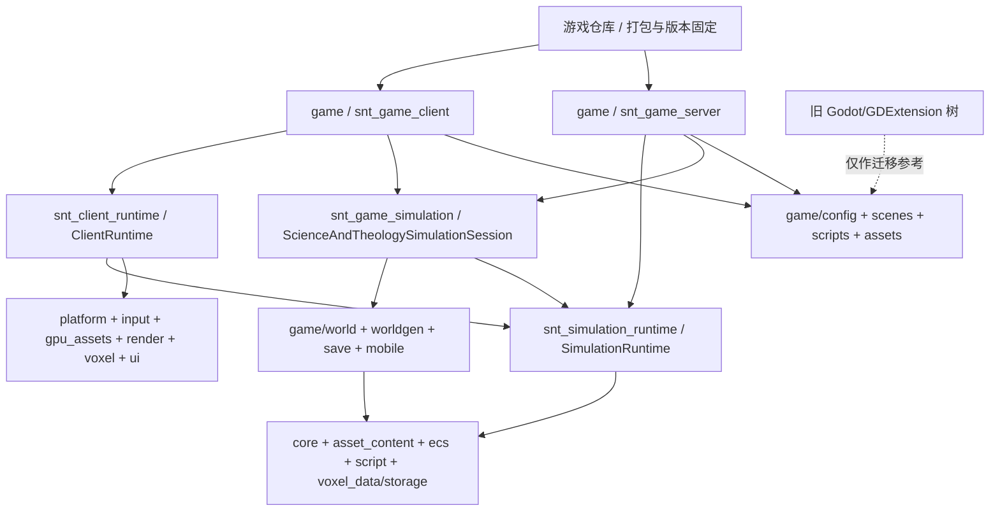

# ScienceAndTheology 项目架构总览

> 当前项目基线，更新于 2026-07-14。
>
> 自研引擎已经取代 Godot/GDExtension 主链。仓库中的旧 Godot 文件只作为玩法和数据迁移来源，不参与当前顶层 CMake 构建。

## 1. 项目定位

Science & Theology 是一款 C++20 Vulkan 3D 体素工厂、探索与魔法游戏。世界、工厂、飞船、遗迹和魔法结构使用统一的三维 voxel/chunk 坐标体系；长期方向是服务端权威的连续宇宙、分区加载和分级模拟。

存档格式策略（当前）：
只读写最新格式。游戏 chunk payload 当前为 v9，engine raw region framing 当前为 v2；格式升级后旧存档直接拒绝，不保留兼容读取或离线转换器。开发期同步重生成测试资产和存档。


当前技术栈：

| 领域 | 技术 |
| --- | --- |
| 游戏宿主 | C++20 可执行程序 + CMake 运行包组装 |
| 引擎 | 独立 `snt_engine` Git 子模块 |
| 平台 | SDL3 |
| 渲染 | Vulkan 1.3、VMA、RenderGraph |
| ECS | EnTT |
| 玩法脚本 | AngelScript，主线程事务热重载 |
| UI | 自研保留模式 MUI、Arc2D、HarfBuzz、ICU |
| 测试 | GoogleTest + CTest |

## 2. 当前分层



所有权原则：

- 游戏仓库拥有可执行程序、内容、配置、运行时目录布局和引擎版本指针。
- 引擎仓库拥有可复用的运行时、模块接口、工具和引擎单元测试。
- 引擎不读取游戏源码目录，不假设子模块名称，不拥有游戏内容包。
- 旧 Godot/GDScript/GDExtension API 不增加兼容层；迁移完成后删除旧接口。

## 3. 仓库结构

| 路径 | 当前职责 | 是否进入当前构建 |
| --- | --- | --- |
| `CMakeLists.txt` | 添加 `snt_engine` 和 `game` | 是 |
| `snt_engine/` | 引擎 Git 子模块 | 是 |
| `game/` | 游戏宿主、配置、场景、AngelScript 和打包 | 是 |
| `test_assets/`、`resource/terrain/` | 当前开发资产，由 game 打包 | 是，作为资源复制 |
| `docs/` | 当前设计与迁移契约 | 否 |
| `src/` | 旧 Godot 时代 C++ core/binding/adapters | 否，仅迁移来源 |
| `scripts/` | 旧 GDScript 玩法和 UI | 否，仅迁移来源 |
| `project.godot`、`*.tscn`、`*.gdextension` | 旧 Godot 工程入口 | 否 |
| `tests/core/` | 旧核心测试链 | 否；当前引擎测试在 `snt_engine/tests/` |

当前有效的游戏文件：

```text
game/
├── CMakeLists.txt
├── client/main.cpp
├── server/main.cpp
├── runtime/                     # client/server 共用运行包定位与配置读取
├── simulation/                  # client/server 共用确定性游戏会话
├── config/
│   ├── engine.json
│   └── default_manifest.json
├── world/                       # 游戏 sidecar、语义化存档、移动结构
├── worldgen/                    # 游戏地形和生态生成规则
├── tests/                       # game-owned 单元测试
├── tools/                       # game-owned ECS/world smoke tool
├── scenes/default_scene.bin
└── scripts/p7_bootstrap.as
```

## 4. 宿主和运行包

`game/runtime/runtime_package.*` 统一定位可执行程序、构造三个显式根目录，并从同一个游戏包配置读取 `RuntimeConfig` 与 `GameSessionConfig`。`game/client/main.cpp` 创建 `ClientRuntime + ScienceAndTheologyClientSession`；`game/server/main.cpp` 创建 `SimulationRuntime + ScienceAndTheologySimulationSession`。二者复用 `snt_game_simulation` 中的脚本、机器 worker 和 terrain/sidecar 初始化：

```text
<exe>/
├── science_and_theology.exe
├── engine/                    # 引擎只读资源
│   ├── shaders/
│   └── third_party/icu4c/
├── game/                      # 游戏只读内容
│   ├── config/
│   ├── scenes/
│   ├── scripts/
│   └── assets/
└── user/                      # 运行时可写
    ├── logs/
    ├── saves/
    └── cache/
```

图形宿主将 `IClientSession` 的所有权移交给 `ClientRuntime::init`，随后只调用 `run` 和 `shutdown`。`ClientRuntime` 先初始化并组合 `SimulationRuntime`，再创建 SDL/Vulkan/GPU 表现服务。`ScienceAndTheologySimulationSession` 的 `ISimulationSession` 阶段负责脚本、机器系统和 terrain sidecar；`ScienceAndTheologyClientSession` 的 `IClientSession` 阶段才加载场景、配置相机、玩家与 gameplay UI。无头宿主直接交付 `ScienceAndTheologySimulationSession` 给 `SimulationRuntime`，支持 `--ticks N` 的确定性包自检；它不创建或链接 SDL/Vulkan 客户端目标。

## 5. 当前能力

| 能力 | 状态 |
| --- | --- |
| SDL3 窗口、输入和鼠标锁定 | 已实现 |
| Vulkan 1.3、swapchain、RenderGraph、mesh/chunk/UI 绘制 | 已实现原型 |
| EnTT World、稳定 EntityGuid、三层组件和 `SystemScheduler` | 已实现；`snt_ecs` 仅含 core 组件，render 与游戏组件分别归 `snt_render_components` 和 `game/` |
| 固定 20 TPS scheduler 逻辑和独立渲染帧 | 已实现；Chunk 与玩家输入/交互保持主线程，MachineTick 和 PlayerPhysics 走资源独立 worker；机器达到阈值时在内部并行计算 |
| `SimulationRuntime + ISimulationSession` / `ClientRuntime + IClientSession` 内容边界 | 已实现；旧 `Runtime` / `IGameSession` API 已删除 |
| CMake 直接依赖审计 | 已实现；配置期检查 20 个引擎模块的 145 条内部 include 边 |
| asset catalog / GPU residency | `snt_asset_content` 提供 `FilesystemAssetSource`、catalog 和稳定 mesh identity，由 SimulationRuntime 拥有；`snt_gpu_assets` 的 `AssetManager` / `VulkanGpuAssetUploader` 仅由 ClientRuntime 在 Vulkan device 生命周期内拥有 |
| 世界生成、chunk 数据、region/planet save、动态结构 | A 方案首轮已实现：引擎拥有通用 voxel data/raw region framing，游戏拥有 sidecar、生成规则、v9 payload 和移动结构；移动结构尚未由当前会话编排 |
| greedy meshing、chunk GPU 上传、voxel 碰撞和射线 | 已实现 |
| 保留模式 UI、Unicode 文本、背包/合成原型 | 已实现基础能力 |
| AngelScript 加载、FileWatcher、事务 reload、game-owned 内容注册 | P7.1 已实现 |
| game-owned 炉子 `MachineTickSystem`、配方快照和事件边界 | P7.2.1 已实现，主线程 capture、worker 分片计算、barrier 按 Guid 顺序写回 |
| 其余工业/魔法/任务迁移 | 未完成，旧代码仍是迁移参考 |
| 安全 ECS 调度 | scheduler 契约已实现、测试并接入 SimulationRuntime；MachineTick 与 PlayerPhysics 均为生产 worker，已具备机器内部并行和跨系统并行扇出 |
| headless simulation runtime | 已实现 `snt_simulation_runtime` 与独立测试目标；不创建、不链接 SDL/Vulkan/client runtime |
| dedicated server | 已实现：`snt_game_server` 通过 server session 复用 `snt_game_simulation`，支持 `--ticks N`、`--network` 和端口覆盖；不链接 SDL/Vulkan/client runtime |
| replication transport 和服务端权威联机 | `snt_network` 已实现 TCP reliable + UDP unreliable、wire codec、主线程 tick 编排和 Steam P2P adapter；`snt_game_network` 已实现 `SNTG` envelope、登录准入状态机和命令边界，默认关闭玩家准入；concrete 认证、gameplay command、AOI、snapshot/delta 仍待实现 |
| 音频 | 未实现 |

“已实现”只表示当前自研引擎目标中存在对应代码；是否已经被游戏主循环使用，以详细引擎文档的模块表为准。

## 6. 运行时数据边界

- Scene：二进制启动实体模板，目前只序列化 Transform、MeshRef 和 Camera。
- ECS core：`ecs/core_components.h` 仅保留独立于表现和玩法的值类型。
- Render components：`render/render_components.h` 仅描述 Transform、Camera、MeshRef。
- Game components：`game/client/game_components.h` 拥有 Health、Inventory 和游戏 marker。
- Asset source：SimulationRuntime 从 `game_root` 创建 `FilesystemAssetSource`，它拥有显式内容根并拒绝任何带根的路径和根目录逃逸；可在非渲染加载线程使用，不访问 `World` 或全局服务。
- Asset catalog：SimulationRuntime 通过 source 按 `assets.manifest_path` 加载 `AssetCatalog`，将稳定内容 ID 解析为相对 source request；解析后查询不访问文件/GPU，并通过 `SimulationServices` 发布给 simulation session。
- GPU residency：`VulkanGpuAssetUploader` 在 ClientRuntime 的 render thread/device 生命周期内实现 `IGpuAssetUploader`；它按 canonical source 共享底层 mesh、为每个调用者返回独立 token lease，并由 `AssetManager` 在 device wait-idle 后执行 release/evict。场景仅通过 `IMeshAssetReferenceResolver` 使用稳定 `MeshHandle`，不接触 Vulkan。
- Generic voxel data：`snt_voxel_data` 只拥有 terrain、`VoxelChunk`、`ChunkKey` 和 `ChunkRegistry`；SimulationRuntime、renderer、player 只处理这一层。
- Voxel storage：`snt_voxel_storage` 只读写 opaque chunk payload 的 raw region v2 framing，并声明 `IVoxelWorldStorage`；它不解释游戏语义。
- Game world save：`snt_game_world_data/worldgen/save/mobile` 拥有方块实体、生态、物种、生成规则、移动结构和 v9 游戏 payload。`GameSaveManager` 保存时组合 voxel 与 sidecar，加载时再拆回两个 registry。
- Game content：JSON、AngelScript 和资源 manifest，由 `game/` 拥有。
- Script state：`GameContentRegistry` 的状态存储只跨 reload 保留，不是持久存档。
- 用户数据：只能写入 `user_root`。

当前项目未正式发布，不维护旧 API 或旧存档格式兼容。格式变更时更新版本、测试和开发资产，读取旧格式应在一次场景失败或一次维度扫描中汇总记录后拒绝。

## 7. 开发规则

1. 优先通过低频、可检索日志解决不确定问题；不要增加每帧、每实体、每 voxel 的 Info 日志。
2. 新模块先声明所有权、生命周期、线程亲和性和依赖接口，再写实现。
3. CMake 直接依赖必须与源码直接 include 一致，禁止依赖聚合目标掩盖漏链接。
4. 玩法内容进入 `game/`；通用运行时进入 `snt_engine/`。
5. 引擎子模块的修改先在引擎仓库提交，再在游戏仓库更新子模块指针。
6. 旧 Godot/API 迁移完成后直接删除，只保留最新接口。
7. 多种可行方案必须记录优点、缺点和最终决定，不在文档中把未决定方案写成现状。

## 8. 构建和验证

游戏构建：

```powershell
cmake -S . -B build -DSNT_BUILD_TESTS=OFF
cmake --build build --target snt_game_client --config Debug
cmake --build build --target snt_game_server --config Debug
```

引擎测试建议使用独立目录：

```powershell
cmake -S snt_engine -B build-engine-tests -DSNT_BUILD_TESTS=ON
cmake --build build-engine-tests --target snt_tests snt_simulation_runtime_tests --config Debug
ctest --test-dir build-engine-tests -C Debug --output-on-failure
```

`snt_simulation_runtime_tests` 只链接模拟闭包，验证启动和固定 tick 不会引入 SDL/Vulkan/client runtime；`snt_tests` 覆盖其余引擎单元行为。涉及实际窗口/Vulkan 的完整 ClientRuntime 启停覆盖仍需补充。

每次 CMake 配置都会先审计引擎模块的 quoted internal include；漏掉直接 `target_link_libraries` 依赖时，配置会失败并指出消费者目标、源码和缺失模块。

## 9. 相关文档

- [自研引擎架构设计.md](自研引擎架构设计.md)：引擎真实模块、问题、线程模型、目标接口和决策选项。
- [游戏网络协议设计.md](游戏网络协议设计.md)：游戏拥有的版本化 payload、认证/命令/AOI/snapshot 边界和当前实现状态。
- [p7_玩法迁移设计.md](p7_玩法迁移设计.md)：AngelScript 玩法迁移实施契约。
- [unified_universe_world_design.md](unified_universe_world_design.md)：统一宇宙 World、Sector、Chunk 和坐标设计。
- [源律升华体系融合设计.md](源律升华体系融合设计.md)：玩法设计；其中旧 Godot 文件路径只作为迁移来源。

## 10. 当前基线

- 固定引擎子模块基线：`383fb4cbe90927c4c88ab8df6de7a56cc2de7ce1`
- 核对范围：包含 `SimulationRuntime + ISimulationSession`、`ClientRuntime + IClientSession`、SimulationRuntime scheduler、P7.2.1 gameplay、P0 CMake 依赖隔离，以及 A 方案 voxel/game world 数据边界
- 更新日期：2026-07-14
