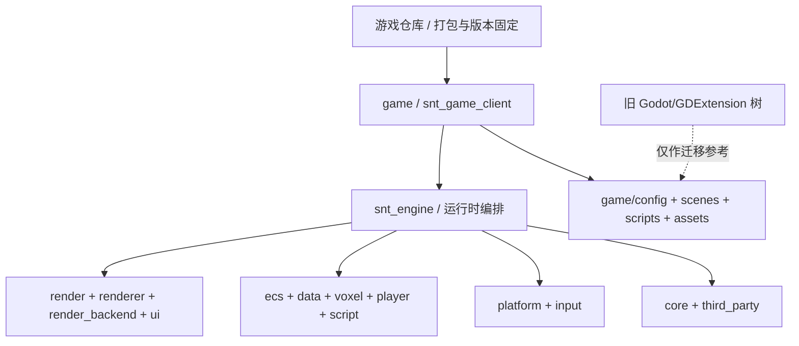

# ScienceAndTheology 项目架构总览

> 当前项目基线，更新于 2026-07-10。
>
> 自研引擎已经取代 Godot/GDExtension 主链。仓库中的旧 Godot 文件只作为玩法和数据迁移来源，不参与当前顶层 CMake 构建。

## 1. 项目定位

Science & Theology 是一款 C++20 Vulkan 3D 体素工厂、探索与魔法游戏。世界、工厂、飞船、遗迹和魔法结构使用统一的三维 voxel/chunk 坐标体系；长期方向是服务端权威的连续宇宙、分区加载和分级模拟。

当前技术栈：

| 领域 | 技术 |
| --- | --- |
| 游戏宿主 | C++20 可执行程序 + CMake 运行包组装 |
| 引擎 | 独立 `snt_engine` Git 子模块 |
| 平台 | SDL3 |
| 渲染 | Vulkan 1.3、VMA、RenderGraph |
| ECS | EnTT |
| 玩法脚本 | AngelScript，主线程事务热重载 |
| UI | 自研保留模式 MUI、Arc2D、HarfBuzz、ICU |
| 测试 | GoogleTest + CTest |

## 2. 当前分层



所有权原则：

- 游戏仓库拥有可执行程序、内容、配置、运行时目录布局和引擎版本指针。
- 引擎仓库拥有可复用的运行时、模块接口、工具和引擎单元测试。
- 引擎不读取游戏源码目录，不假设子模块名称，不拥有游戏内容包。
- 旧 Godot/GDScript/GDExtension API 不增加兼容层；迁移完成后删除旧接口。

## 3. 仓库结构

| 路径 | 当前职责 | 是否进入当前构建 |
| --- | --- | --- |
| `CMakeLists.txt` | 添加 `snt_engine` 和 `game` | 是 |
| `snt_engine/` | 引擎 Git 子模块 | 是 |
| `game/` | 游戏宿主、配置、场景、AngelScript 和打包 | 是 |
| `test_assets/`、`resource/terrain/` | 当前开发资产，由 game 打包 | 是，作为资源复制 |
| `docs/` | 当前设计与迁移契约 | 否 |
| `src/` | 旧 Godot 时代 C++ core/binding/adapters | 否，仅迁移来源 |
| `scripts/` | 旧 GDScript 玩法和 UI | 否，仅迁移来源 |
| `project.godot`、`*.tscn`、`*.gdextension` | 旧 Godot 工程入口 | 否 |
| `tests/core/` | 旧核心测试链 | 否；当前引擎测试在 `snt_engine/tests/` |

当前有效的游戏文件：

```text
game/
├── CMakeLists.txt
├── client/main.cpp
├── config/
│   ├── engine.json
│   └── default_manifest.json
├── scenes/default_scene.bin
└── scripts/p7_bootstrap.as
```

## 4. 宿主和运行包

`game/client/main.cpp` 是当前唯一应用入口。它定位可执行程序，构造三个显式根目录，加载游戏配置，再启动引擎：

```text
<exe>/
├── science_and_theology.exe
├── engine/                    # 引擎只读资源
│   ├── shaders/
│   └── third_party/icu4c/
├── game/                      # 游戏只读内容
│   ├── config/
│   ├── scenes/
│   ├── scripts/
│   └── assets/
└── user/                      # 运行时可写
    ├── logs/
    ├── saves/
    └── cache/
```

宿主只调用 `Engine::init`、`run` 和 `shutdown`。当前 Engine 内部仍包含演示世界和玩法 UI，目标边界及拆分方案见 [自研引擎架构设计.md](自研引擎架构设计.md)。

## 5. 当前能力

| 能力 | 状态 |
| --- | --- |
| SDL3 窗口、输入和鼠标锁定 | 已实现 |
| Vulkan 1.3、swapchain、RenderGraph、mesh/chunk/UI 绘制 | 已实现原型 |
| EnTT World、稳定 EntityGuid、基础组件和顺序 System | 已实现 |
| 固定 20 TPS 单线程逻辑和独立渲染帧 | 已实现 |
| 世界生成、chunk 数据、region/planet save、动态结构 | 已实现；部分模块尚未接入游戏运行时 |
| greedy meshing、chunk GPU 上传、voxel 碰撞和射线 | 已实现 |
| 保留模式 UI、Unicode 文本、背包/合成原型 | 已实现基础能力 |
| AngelScript 加载、FileWatcher、事务 reload、内容注册 | P7.1 已实现 |
| 炉子 `MachineTickSystem`、配方快照和事件边界 | P7.2.1 已实现 |
| 其余工业/魔法/任务迁移 | 未完成，旧代码仍是迁移参考 |
| 安全并行 ECS 调度 | 未实现 |
| replication transport 和服务端权威联机 | 仅接口声明 |
| dedicated/headless server | 未实现 |
| 音频 | 未实现 |

“已实现”只表示当前自研引擎目标中存在对应代码；是否已经被游戏主循环使用，以详细引擎文档的模块表为准。

## 6. 运行时数据边界

- Scene：二进制启动实体模板，目前只序列化 Transform、MeshRef 和 Camera。
- World save：universe/planet/region/chunk 数据，用于长期世界状态。
- Game content：JSON、AngelScript 和资源 manifest，由 `game/` 拥有。
- Script state：`RegistryHub::StateStore` 只跨 reload 保留，不是持久存档。
- 用户数据：只能写入 `user_root`。

当前项目未正式发布，不维护旧 API 或旧存档格式兼容。格式变更时更新版本、测试和开发资产，读取旧格式应记录一次明确日志后拒绝。

## 7. 开发规则

1. 优先通过低频、可检索日志解决不确定问题；不要增加每帧、每实体、每 voxel 的 Info 日志。
2. 新模块先声明所有权、生命周期、线程亲和性和依赖接口，再写实现。
3. CMake 直接依赖必须与源码直接 include 一致，禁止依赖聚合目标掩盖漏链接。
4. 玩法内容进入 `game/`；通用运行时进入 `snt_engine/`。
5. 引擎子模块的修改先在引擎仓库提交，再在游戏仓库更新子模块指针。
6. 旧 Godot/API 迁移完成后直接删除，只保留最新接口。
7. 多种可行方案必须记录优点、缺点和最终决定，不在文档中把未决定方案写成现状。

## 8. 构建和验证

游戏构建：

```powershell
cmake -S . -B build -DSNT_BUILD_TESTS=OFF
cmake --build build --target snt_game_client --config Debug
```

引擎测试建议使用独立目录：

```powershell
cmake -S snt_engine -B build-engine-tests -DSNT_BUILD_TESTS=ON
cmake --build build-engine-tests --target snt_tests --config Debug
ctest --test-dir build-engine-tests -C Debug --output-on-failure
```

`snt_tests` 是当前唯一引擎单元测试可执行程序。涉及窗口/Vulkan/完整 Engine 启停的集成覆盖仍需补充。

## 9. 相关文档

- [自研引擎架构设计.md](自研引擎架构设计.md)：引擎真实模块、问题、线程模型、目标接口和决策选项。
- [p7_玩法迁移设计.md](p7_玩法迁移设计.md)：AngelScript 玩法迁移实施契约。
- [unified_universe_world_design.md](unified_universe_world_design.md)：统一宇宙 World、Sector、Chunk 和坐标设计。
- [源律升华体系融合设计.md](源律升华体系融合设计.md)：玩法设计；其中旧 Godot 文件路径只作为迁移来源。

## 10. 当前基线

- 固定引擎子模块基线：`9af2c001a0d15fc6976999f6ad824f30a0c0c678`
- 核对范围：包含当前工作区的 P7.2.1 gameplay 变更
- 更新日期：2026-07-10
